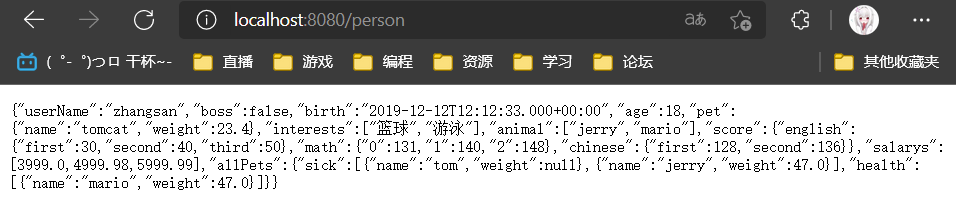

# 一、Spring 与 SpringBoot

## 1、Spring 能做什么

### (1)、Spring 的能力


### (2)、Spring 的生态
- https://spring.io/projects/spring-boot
- 覆盖了：
  - web开发
  - 数据访问
  - 安全控制
  - 分布式
  - 消息服务
  - 移动开发
  - 批处理
  - ......


### (3)、Spring5 重大升级
1. 响应式编程


2. 内部源码设计
- 基于Java8的一些新特性，如：接口默认实现。重新设计源码架构。


## 2、为什么用 SpringBoot
> Spring Boot makes it easy to create stand-alone, production-grade Spring based Applications that you can "just run".
>
>能快速创建出生产级别的 Spring 应用

### (1)、SpringBoot 优点
- 创建独立 Spring 应用，不需要原生的 spring
- 内嵌 web 服务器
- 自动 starter 依赖，简化构建配置
- 自动配置 Spring 以及第三方功能
- 提供生产级别的监控、健康检查及外部化配置
- 无代码生成、无需编写 XML


### (2)、SpringBoot 优点
- 人称版本帝，迭代快，需要时刻关注变化
- 封装太深，内部原理复杂，不容易精通


## 3、时代背景

### (1)、微服务
>James Lewis and Martin Fowler (2014) 提出微服务完整概念。
>
>https://martinfowler.com/microservices/
- 微服务是一种架构风格
- 一个应用拆分为一组小型服务
- 每个服务运行在自己的进程内，也就是可独立部署和升级
- 服务之间使用轻量级HTTP交互
- 服务围绕业务功能拆分
- 可以由全自动部署机制独立部署
- 去中心化，服务自治。服务可以使用不同的语言、不同的存储技术


### (2)、分布式
1. 分布式的困难
  - 远程调用
  - 服务发现
  - 负载均衡
  - 服务容错
  - 配置管理
  - 服务监控
  - 链路追踪
  - 日志管理
  - 任务调度
2. 分布式的解决
  - SpringBoot + SpringCloud


### (3)、云原生
- 原生应用如何上云。 Cloud Native
1. 上云的困难
- 服务自愈
- 弹性伸缩
- 服务隔离
- 自动化部署
- 灰度发布
- 流量治理
- ......
2. 上云的解决


## 4、如何学习 SpringBoot
- 官网文档架构，2020-02-09当前最新怎顶板为 2.6.3
- https://docs.spring.io/spring-boot/docs/current/reference/html/


- 查看版本新特性：https://github.com/spring-projects/spring-boot/wiki#release-notes


# 二、SpringBoot2入门

## 1、系统要求
- spring-boot 2.3.4
- Java 8 & 兼容 java 14
- Maven 3.3 +
---
- maven 配置文件 settings.xml 的设置（注意下面是否还有 profiles 标签）
```xml
    <mirrors>
      <mirror>
        <id>nexus-aliyun</id>
        <mirrorOf>central</mirrorOf>
        <name>Nexus aliyun</name>
        <url>http://maven.aliyun.com/nexus/content/groups/public</url>
      </mirror>
  </mirrors>

  <profiles>
         <profile>
              <id>jdk-1.8</id>
              <activation>
                <activeByDefault>true</activeByDefault>
                <jdk>1.8</jdk>
              </activation>
              <properties>
                <maven.compiler.source>1.8</maven.compiler.source>
                <maven.compiler.target>1.8</maven.compiler.target>
                <maven.compiler.compilerVersion>1.8</maven.compiler.compilerVersion>
              </properties>
         </profile>
  </profiles>
```


## 2、HelloWorld
- 需求：浏览发送 /hello 请求，响应 Hello，Spring Boot 2

1. 创建 maven 工程，父项目


- 在 pom.xml 文件中引入 spring-boot 的父项目
```xml
    <?xml version="1.0" encoding="UTF-8"?>
    <project xmlns="http://maven.apache.org/POM/4.0.0"
            xmlns:xsi="http://www.w3.org/2001/XMLSchema-instance"
            xsi:schemaLocation="http://maven.apache.org/POM/4.0.0 http://maven.apache.org/xsd/maven-4.0.0.xsd">
        <modelVersion>4.0.0</modelVersion>

        <groupId>com.yuehai.sb</groupId>
        <artifactId>11_SpringBoot</artifactId>
        <packaging>pom</packaging>
        <version>1.0-SNAPSHOT</version>
        <modules>
            <module>01_SpringBoot_HelloWorld</module>
        </modules>

        <!-- 在父项目中引入 spring-boot 的父项目 -->
        <parent>
            <groupId>org.springframework.boot</groupId>
            <artifactId>spring-boot-starter-parent</artifactId>
            <version>2.3.4.RELEASE</version>
        </parent>

    </project>
```

2. 创建新模块，项目结构：


3. 引入依赖
```xml
    <?xml version="1.0" encoding="UTF-8"?>
    <project xmlns="http://maven.apache.org/POM/4.0.0"
            xmlns:xsi="http://www.w3.org/2001/XMLSchema-instance"
            xsi:schemaLocation="http://maven.apache.org/POM/4.0.0 http://maven.apache.org/xsd/maven-4.0.0.xsd">
        <parent>
            <artifactId>11_SpringBoot</artifactId>
            <groupId>com.yuehai.sb</groupId>
            <version>1.0-SNAPSHOT</version>
        </parent>
        <modelVersion>4.0.0</modelVersion>

        <artifactId>01_SpringBoot_HelloWorld</artifactId>

        <dependencies>
            <!-- 引入 sptingBoot 的依赖，版本号由父项目确定 -->
            <!-- web 的场景启动器 -->
            <dependency>
                <groupId>org.springframework.boot</groupId>
                <artifactId>spring-boot-starter-web</artifactId>
            </dependency>

        </dependencies>

    </project>
```
4. 创建主程序
```java
    /**
    * 表明这是一个 springBoot 应用
    * 称为主程序类
    */
    @SpringBootApplication
    public class MainApplication {

        // main 方法，启动 springBoot 应用
        public static void main(String[] args) {
            // 参数1：传入主程序类的 class 对象；参数2：main 方法的 args 参数
            SpringApplication.run(MainApplication.class,args);
        }
    }
```
5. 编写业务
```java
    // @ResponseBody 用于标识一个控制器方法，
    // 可以将该方法的返回值直接作为响应报文的响应体响应到浏览器
    // 写在类上，表示这个类中的所有方法上都有该注解
    // @ResponseBody
    // 表明是 Controller 层
    // @Controller

    // @RestController：上面上个注解的结合
    @RestController
    public class HelloController {

        // 请求地址，处理用户的 /hello 请求
        @RequestMapping("/hello")
        public String hello(){
            return "Hello Spring Boot 2";
        }
    }
```
6. 测试：直接运行main方法
7. 访问请求地址：http://localhost:8080/hello


8. 简化配置，官方配置文件说明文档地址：https://docs.spring.io/spring-boot/docs/current/reference/html/application-properties.html#application-properties
```java
    1
```
9. 简化部署，把项目打成 jar 包，直接在目标服务器执行即可。
     1. 引入 spring-boot-maven-plugin 依赖
    ```xml
        <!-- SpringBoot 打为 jar 包，部署项目所需 -->
        <build>
            <plugins>
                <plugin>
                    <groupId>org.springframework.boot</groupId>
                    <artifactId>spring-boot-maven-plugin</artifactId>
                </plugin>
            </plugins>
        </build>
    ```
    2. 把项目打成 jar 包

    

    3. 执行完成 jar 包会生成在项目根目录下的 target 目录中

    

    4. 直接在目录地址前输入cmd进入命令行

    

    5. 进入命令行之后，输入命令：java -jar 01_SpringBoot_HelloWorld-1.0-SNAPSHOT.jar，即可启动服务
    
    
    
    6. 注意点：在属性中取消掉 cmd 的快速编辑模式

    


# 三、了解自动配置原理

## 1、SpringBoot特点

### (1)、依赖管理
1. 父项目做依赖管理
```xml
    <!-- 在父项目中引入 spring-boot 的父项目 -->
    <parent>
        <groupId>org.springframework.boot</groupId>
        <artifactId>spring-boot-starter-parent</artifactId>
        <version>2.3.4.RELEASE</version>
    </parent>

    <!-- 上面 spring-boot-starter-parent 的父项目 -->
    <!-- 几乎声明了所有开发中常用的依赖的版本号，自动版本仲裁机制 -->
    <parent>
        <groupId>org.springframework.boot</groupId>
        <artifactId>spring-boot-dependencies</artifactId>
        <version>2.3.4.RELEASE</version>
  </parent>
```
2. 可以修改默认版本号
```xml
    <!-- 1、查看 spring-boot-dependencies 里面规定当前依赖的版本 用的 key -->
    <!-- 2、在当前项目里面重写配置 -->
    <properties>
        <mysql.version>5.1.43</mysql.version>
    </properties>
```
3. 开发导入 starter 场景启动器
    - SpringBoot 所有支持的场景：https://docs.spring.io/spring-boot/docs/current/reference/html/using-spring-boot.html#using-boot-starter
```xml
    <!--
        1、见到很多 spring-boot-starter-*，*：就某种场景
        2、只要引入starter，这个场景的所有常规需要的依赖我们都自动引入
        3、见到的  *-spring-boot-starter： 第三方为我们提供的简化开发的场景启动器。
       -->
    <!-- 所有场景启动器最底层的依赖，springBoot 自动配置的核心依赖 -->
    <dependency>
        <groupId>org.springframework.boot</groupId>
        <artifactId>spring-boot-starter</artifactId>
        <version>2.3.4.RELEASE</version>
        <scope>compile</scope>
    </dependency>
```
4. 无需关注版本号，自动版本仲裁
   1. 引入依赖默认都可以不写版本
   2. 引入非版本仲裁的jar，要写版本号。


### (2)、自动配置
1. 自动配好Tomcat
   1. 自动引入 Tomcat 依赖。
   2. 自动配置 Tomcat
2. 自动配好SpringMVC
   1. 引入 SpringMVC 全套组件
   2. 自动配好 SpringMVC 常用组件（功能）
3. 自动配好Web常见功能，如：字符编码问题
   1. SpringBoot 帮我们配置好了所有 web 开发的常见场景
4. 默认的包结构
   1. <font color="red">主程序</font>所在包及其下面的所有子包里面的组件都会被默认扫描进来
   2. 无需以前的包扫描配置
   3. 想要改变扫描路径：@SpringBootApplication(scanBasePackages="com.atguigu")
       - 或者 @ComponentScan 指定扫描路径
        ```java
            /**
             * 表明这是一个 springBoot 应用
             * 称为主程序类
             * scanBasePackages = "com.yuehai"：规定扫描的包为：com.yuehai
             */
            // @SpringBootApplication(scanBasePackages = "com.yuehai")

            // 下面三个注解与上面一个注解的功能相同
            @SpringBootConfiguration
            @EnableAutoConfiguration
            @ComponentScan("com.yuehai")
            public class MainApplication {

                // main 方法，启动 springBoot 应用
                public static void main(String[] args) {
                    // 参数1：传入主程序类的 class 对象；参数2：main 方法的 args 参数
                    SpringApplication.run(MainApplication.class,args);
                }
            }
        ```
5. 各种配置拥有默认值
   1. 默认配置最终都是映射到某个类上，如：MultipartProperties
   2. 配置文件的值最终会绑定每个类上，这个类会在容器中创建对象
6. 按需加载所有自动配置项
   1. 非常多的 starter
   2. <font color="red">引入了哪些场景这个场景的自动配置才会开启</font>
   3. SpringBoot 所有的自动配置功能都在 spring-boot-autoconfigure 包里面
   4. ......
7. ......


## 2、容器功能

### (1)、组件添加

#### ①、@Configuration（配置）
1. 基本使用
2. Full 模式与 Lite 模式
   1. 示例
   2. 最佳实战
      1. 配置类组件之间无依赖关系用 Lite 模式加速容器启动过程，减少判断
      2. 配置类组件之间有依赖关系，方法会被调用得到之前单实例组件，用 Full 模式
3. 实体类 User
```java
    public class User {

        private String name;
        private Integer age;

        public User() { }
        public User(String name, Integer age){
            this.name = name;
            this.age = age;
        }

        public String getName() { return name; }
        public void setName(String name) { this.name = name; }
        public Integer getAge() { return age; }
        public void setAge(Integer age) { this.age = age; }
    }
```
4. 实体类 Pet
```java
    public class Pet {

        private String name;

        public Pet() { }
        public Pet(String name) {
            this.name = name;
        }

        public String getName() { return name; }
        public void setName(String name) { this.name = name; }
    }
```
5. 配置类 MyConfig
```java
    /**
    * 告诉 springBoot 这是一个配置类 == 配置文件
    * 1、配置类里面使用 @Bean 标注在方法上给容器注册组件，默认也是单实例的
    * 2、配置类本身也是组件
    * 3、@Configuration(proxyBeanMethods = true)（是否是代理 bean 的方法）
    *      proxyBeanMethods：代理 bean 的方法
    *          Full(proxyBeanMethods = true)、【保证每个@Bean方法被调用多少次返回的组件都是单实例的】
    *          Lite(proxyBeanMethods = false)【每个@Bean方法被调用多少次返回的组件都是新创建的】
    *      组件依赖必须使用Full模式默认。其他默认是否Lite模式
    */
    @Configuration
    public class MyConfig {

        /**
        * 给容器中添加组件，以方法名作为组件的 id，
        * 返回类型就是组件的类型，返回的值就是组件在容器中的实例
        * Full:外部无论对配置类中的这个组件注册方法调用多少次获取的都是之前注册容器中的单实例对象
        */
        @Bean
        public User user01(){
            return new User("月海",14);
        }

        // @Bean("tom")：给组件（实例）设置自定义的名称
        @Bean("tom")
        public Pet tomcatPrt(){
            return new Pet("tomcat");
        }

    }
```
6. 主程序类 MainApplication
```java
    /**
    * 表明这是一个 springBoot 应用
    * 称为主程序类
    * scanBasePackages = "com.yuehai"：规定扫描的包为：com.yuehai
    */
    // @SpringBootApplication(scanBasePackages = "com.yuehai")

    // 下面三个注解与上面一个注解的功能相同
    @SpringBootConfiguration
    @EnableAutoConfiguration
    @ComponentScan("com.yuehai")
    public class MainApplication {

        // main 方法，启动 springBoot 应用
        public static void main(String[] args) {
            // 参数1：传入主程序类的 class 对象；参数2：main 方法的 args 参数
            // 1、返回我们IOC容器
            ConfigurableApplicationContext run = SpringApplication.run(MainApplication.class,args);

            // 2、查看容器里面的组件
            String[] names = run.getBeanDefinitionNames();
            for (String name : names) {
                System.out.println(name);
            }

            // 3、从容器中获取组件
            Pet tom01 = run.getBean("tom", Pet.class);
            Pet tom02 = run.getBean("tom", Pet.class);
            // 组件：true
            System.out.println("组件：" + (tom01 == tom02));

            // 4、获取配置类的实例
            MyConfig bean = run.getBean(MyConfig.class);
            // com.yuehai.sb.config.MyConfig$$EnhancerBySpringCGLIB$$2b5bbc@437ebf59
            System.out.println(bean);

            /**
            * 如果 @Configuration(proxyBeanMethods = true) 代理对象调用方法。
            * SpringBoot 总会检查这个组件是否在容器中有。
            * 保持组件单实例
            */
            User user = bean.user01();
            User user1 = bean.user01();
            // true
            System.out.println(user == user1);

        }
    }
```

#### ②、@Bean、@Component、@Controller、@Service、@Repository
- 不用上面的方法的话也可以使用以前的注解方式：
1. @Component：表示是一个组件
2. @Controller：表示是一个控制器
3. @Service：表示是一个业务逻辑组件
4. @Repository：表示是一个持久层组件

#### ③、@ComponentScan、@Import
- @Import 高级用法：https://www.bilibili.com/video/BV1gW411W7wy?p=8
```java
    /**
    * 告诉 springBoot 这是一个配置类 == 配置文件
    * 1、配置类里面使用 @Bean 标注在方法上给容器注册组件，默认也是单实例的
    * 2、配置类本身也是组件
    * 3、@Configuration(proxyBeanMethods = true)（是否是代理 bean 的方法）
    *      proxyBeanMethods：代理 bean 的方法
    *          Full(proxyBeanMethods = true)、【保证每个@Bean方法被调用多少次返回的组件都是单实例的】
    *          Lite(proxyBeanMethods = false)【每个@Bean方法被调用多少次返回的组件都是新创建的】
    *      组件依赖必须使用Full模式默认。其他默认是否Lite模式
    *
    * 4、@Import({User.class})：给容器中自动创建出这个类型的组件、默认组件的名字就是全类名
    *
    * 5、@ImportResource("classpath:beans.xml")导入 Spring 的配置文件
    */
    @Configuration
    // 将 User 类添加到容器中
    @Import({User.class})
    public class MyConfig {

        /**
        * 给容器中添加组件，以方法名作为组件的 id，
        * 返回类型就是组件的类型，返回的值就是组件在容器中的实例
        * Full:外部无论对配置类中的这个组件注册方法调用多少次获取的都是之前注册容器中的单实例对象
        */
        @Bean
        public User user01(){
            return new User("月海",14);
        }

        // @Bean("tom")：给组件（实例）设置自定义的名称
        @Bean("tom")
        public Pet tomcatPrt(){
            return new Pet("tomcat");
        }

    }
```

#### ④、@Conditional
- 条件装配：满足 @Conditional 指定的条件，则进行组件注入


1. 配置类 MyConfig
```java
    /**
    * 告诉 springBoot 这是一个配置类 == 配置文件
    * 1、配置类里面使用 @Bean 标注在方法上给容器注册组件，默认也是单实例的
    * 2、配置类本身也是组件
    * 3、@Configuration(proxyBeanMethods = true)（是否是代理 bean 的方法）
    *      proxyBeanMethods：代理 bean 的方法
    *          Full(proxyBeanMethods = true)、【保证每个@Bean方法被调用多少次返回的组件都是单实例的】
    *          Lite(proxyBeanMethods = false)【每个@Bean方法被调用多少次返回的组件都是新创建的】
    *      组件依赖必须使用Full模式默认。其他默认是否Lite模式
    *
    * 4、@Import({User.class})：给容器中自动创建出这个类型的组件、默认组件的名字就是全类名
    *
    * 5、@ImportResource("classpath:beans.xml")导入 Spring 的配置文件
    */
    @Configuration
    // 将 User 类添加到容器中
    // @Import({User.class})
    /**
    * 条件装配：满足 @Conditional 指定的条件，才进行组件注入，
    * 当容器中存在指定的组件（bean） tom 时，才会往容器中注册当前类中的所有组件
    * 此时容器中并没有 tom 组件，本注解的判断又是在本类注册之前，所以也不会被注册
    */
    @ConditionalOnBean(name = "tom")
    public class MyConfig {

        /**
        * 给容器中添加组件，以方法名作为组件的 id，
        * 返回类型就是组件的类型，返回的值就是组件在容器中的实例
        * Full:外部无论对配置类中的这个组件注册方法调用多少次获取的都是之前注册容器中的单实例对象
        */
        // 当容器中存在指定的组件（bean） tom 时才会往容器中注册下面的 user01 组件
        // @ConditionalOnBean(name = "tom")
        @Bean
        public User user01(){
            return new User("月海",14);
        }

        // @Bean("tom")：给组件（实例）设置自定义的名称
        @Bean("tom")
        public Pet tomcatPrt(){
            return new Pet("tomcat");
        }

    }
```
2. 主程序类 MainApplication
```java
    /**
    * 表明这是一个 springBoot 应用
    * 称为主程序类、主配置类
    * scanBasePackages = "com.yuehai"：规定扫描的包为：com.yuehai
    */
    // @SpringBootApplication(scanBasePackages = "com.yuehai")

    // 下面三个注解与上面一个注解的功能相同
    @SpringBootConfiguration
    @EnableAutoConfiguration
    @ComponentScan("com.yuehai")
    public class MainApplication {

        // main 方法，启动 springBoot 应用
        public static void main(String[] args) {
            // 参数1：传入主程序类的 class 对象；参数2：main 方法的 args 参数
            // 1、返回我们IOC容器
            ConfigurableApplicationContext run = SpringApplication.run(MainApplication.class,args);

            // 2、查看容器里面的组件
            String[] names = run.getBeanDefinitionNames();
            for (String name : names) {
                System.out.println(name);
            }

            /**
            * 1、注释掉 @Bean("tom")时，测试容器中是否有 tom 对象
            *      false
            * 2、注释掉 @Bean("tom")，在方法上添加 @ConditionalOnBean(name = "tom") 注解时
            *      false
            * 3、不注释 @Bean("tom")，添加 @ConditionalOnBean(name = "tom") 注解时，
            *      false
            */
            boolean tom = run.containsBean("tom");
            System.out.println(tom);
            /**
            * 1、测试容器中是否有 user01 对象
            *      true
            * 2、测试容器中是否有 user01 对象
            *      false
            * 3、测试容器中是否有 user01 对象
            *      true
            */
            boolean user01 = run.containsBean("user01");
            System.out.println(user01);

        }
    }
```


### (2)、原生配置文件引入
- @ImportResource
1. spring 配置文件
```xml
    <?xml version="1.0" encoding="UTF-8"?>
    <beans xmlns="http://www.springframework.org/schema/beans"
        xmlns:xsi="http://www.w3.org/2001/XMLSchema-instance"
        xmlns:context="http://www.springframework.org/schema/context"
        xsi:schemaLocation="http://www.springframework.org/schema/beans http://www.springframework.org/schema/beans/spring-beans.xsd http://www.springframework.org/schema/context https://www.springframework.org/schema/context/spring-context.xsd">

        <bean id="user02" class="com.yuehai.sb.bean.User">
            <property name="name" value="zhangsan" />
            <property name="age" value="18" />
        </bean>

        <bean id="pet02" class="com.yuehai.sb.bean.Pet">
            <property name="name" value="tomcat" />
        </bean>
    </beans>
```
2. 配置类 MyConfig
```java
    /**
    * 告诉 springBoot 这是一个配置类 == 配置文件
    * 1、配置类里面使用 @Bean 标注在方法上给容器注册组件，默认也是单实例的
    * 2、配置类本身也是组件
    * 3、@Configuration(proxyBeanMethods = true)（是否是代理 bean 的方法）
    *      proxyBeanMethods：代理 bean 的方法
    *          Full(proxyBeanMethods = true)、【保证每个@Bean方法被调用多少次返回的组件都是单实例的】
    *          Lite(proxyBeanMethods = false)【每个@Bean方法被调用多少次返回的组件都是新创建的】
    *      组件依赖必须使用Full模式默认。其他默认是否Lite模式
    *
    * 4、@Import({User.class})：给容器中自动创建出这个类型的组件、默认组件的名字就是全类名
    *
    * 5、@ImportResource("classpath:beans.xml")导入 Spring 的配置文件
    */
    @Configuration
    // 将 User 类添加到容器中
    // @Import({User.class})
    /**
    * 条件装配：满足 @Conditional 指定的条件，才进行组件注入，
    * 当容器中存在指定的组件（bean） tom 时，才会往容器中注册当前类中的所有组件
    * 此时容器中并没有 tom 组件，本注解的判断又是在本类注册之前，所以也不会被注册
    */
    // @ConditionalOnBean(name = "tom")
    // 原生配置文件引入
    @ImportResource("classpath:beans.xml")
    public class MyConfig {

        /**
        * 给容器中添加组件，以方法名作为组件的 id，
        * 返回类型就是组件类中的这个组件注册方法调用多少次获取的都是之前注册容器中的单实例对象
        */
        // 当容器中存在指定的组件（bean） tom 时才会往容器中注册下面的 user01 组件
        // @ConditionalOnBean(name = "tom")
        @Bean
        public User user01(){
            return new User("月海",14);
        }

        // @Bean("tom")：给组件（实例）设置自定义的名称
        @Bean("tom")
        public Pet tomcatPrt(){
            return new Pet("tomcat");
        }

    }
```
3. 主程序类 MainApplication
```java
    /**
    * 表明这是一个 springBoot 应用
    * 称为主程序类、主配置类
    * scanBasePackages = "com.yuehai"：规定扫描的包为：com.yuehai
    */
    // @SpringBootApplication(scanBasePackages = "com.yuehai")

    // 下面三个注解与上面一个注解的功能相同
    @SpringBootConfiguration
    @EnableAutoConfiguration
    @ComponentScan("com.yuehai")
    public class MainApplication {

        // main 方法，启动 springBoot 应用
        public static void main(String[] args) {
            // 参数1：传入主程序类的 class 对象；参数2：main 方法的 args 参数
            // 1、返回我们IOC容器
            ConfigurableApplicationContext run = SpringApplication.run(MainApplication.class,args);

            // 2、查看容器里面的组件
            String[] names = run.getBeanDefinitionNames();
            for (String name : names) {
                System.out.println(name);
            }

            // 测试原生配置文件引入
            boolean user02 = run.containsBean("user02");
            System.out.println(user02);
            boolean pet02 = run.containsBean("pet02");
            System.out.println(pet02);

        }
    }
```


### (3)、配置绑定
- 如何使用 Java 读取到 properties 文件中的内容，并且把它封装到 JavaBean 中，以供随时使用

#### ①、原先的方法
```java
    public class getProperties {
        public static void main(String[] args) throws FileNotFoundException, IOException {
            Properties pps = new Properties();
            pps.load(new FileInputStream("a.properties"));
            Enumeration enum1 = pps.propertyNames();//得到配置文件的名字
            while(enum1.hasMoreElements()) {
                String strKey = (String) enum1.nextElement();
                String strValue = pps.getProperty(strKey);
                System.out.println(strKey + "=" + strValue);
                //封装到JavaBean。
            }
        }
    }
```


#### ②、@Component + @ConfigurationProperties
1. 配置文件 application.properties
```properties
    # Car 类中的 brand 属性
    mycar.brand=BYD
    # Car 类中的 price 属性
    mycar.price=100000
```
2. 实体类 Car
```java
    /**
      * 只有在容器中的组件，才会拥有SpringBoot提供的强大功能
      */
     // 将该组件加入到容器中，这样下面的注解才会生效
     @Component
     // 配置绑定，prefix：指配置文件中的属性的前缀
     @ConfigurationProperties(prefix = "mycar")
     public class Car {

         private String brand;
         private Integer price;

         public String getBrand() { return brand; }
         public void setBrand(String brand) { this.brand = brand; }
         public Integer getPrice() { return price; }
         public void setPrice(Integer price) { this.price = price; }

         @Override
         public String toString() {
             return "Car{" +
                     "brand='" + brand + '\'' +
                     ", price=" + price +
                     '}';
         }
     }
```
3. 控制类 HelloController
```java
    /**
      * 用于标识一个控制器方法，
      * 并表示这个类中的所有方法的返回值都直接作为响应报文的响应体响应到浏览器
      */
     @RestController
     public class HelloController {

         // 自动注入，根据类型注入
         @Autowired
         Car car;

         // 请求地址，处理用户的 /hello 请求
         @RequestMapping("/hello")
         public String hello(){
             return "Hello Spring Boot 2";
         }

         //
         @RequestMapping("/car")
         public Car car(){
             return car;
         }
     }
```
4. 访问页面


#### ③、@EnableConfigurationProperties + @ConfigurationProperties
- 若引入的第三方的包类没有 @Component 注解，可以使用此方法
1. 配置文件 application.properties
```properties
    # Car 类中的 brand 属性
    mycar.brand=yuehai
    # Car 类中的 price 属性
    mycar.price=14
```
2. 实体类 Car
```java
    // 配置绑定，prefix：指配置文件中的属性的前缀
    @ConfigurationProperties(prefix = "mycar")
    public class Car {

        private String brand;
        private Integer price;

        public String getBrand() { return brand; }
        public void setBrand(String brand) { this.brand = brand; }
        public Integer getPrice() { return price; }
        public void setPrice(Integer price) { this.price = price; }

        @Override
        public String toString() {
            return "Car{" +
                    "brand='" + brand + '\'' +
                    ", price=" + price +
                    '}';
        }
    }
```
3. 控制类 HelloController
```java
    /**
      * 用于标识一个控制器方法，
      * 并表示这个类中的所有方法的返回值都直接作为响应报文的响应体响应到浏览器
      */
     @RestController
     public class HelloController {

         // 自动注入，根据类型注入
         @Autowired
         Car car;

         // 请求地址，处理用户的 /hello 请求
         @RequestMapping("/hello")
         public String hello(){
             return "Hello Spring Boot 2";
         }

         //
         @RequestMapping("/car")
         public Car car(){
             return car;
         }
     }
```
4. 访问页面


## 3、自动配置原理入门
- 以后再看：https://www.yuque.com/atguigu/springboot/qb7hy2

### (1)、引导加载自动配置类


### (2)、按需开启自动配置项


### (3)、修改默认配置


### (4)、总结：
- SpringBoot 先加载所有的自动配置类  xxxxxAutoConfiguration
- 每个自动配置类按照条件进行生效，默认都会绑定配置文件指定的值。xxxxProperties 里面拿。xxxProperties 和配置文件进行了绑定
- 生效的配置类就会给容器中装配很多组件
- 只要容器中有这些组件，相当于这些功能就有了
- 定制化配置
  - 用户直接自己 @Bean 替换底层的组件
  - 用户去看这个组件是获取的配置文件什么值就去修改。
- <font color="red">xxxxxAutoConfiguration ---> 组件 ---> xxxxProperties里面拿值 ---> application.properties</font>


### (5)、最佳实践
- 引入场景依赖
  - https://docs.spring.io/spring-boot/docs/current/reference/html/using-spring-boot.html#using-boot-starter
- 查看自动配置了哪些（选做）
  - 自己分析，引入场景对应的自动配置一般都生效了
  - 配置文件中 debug=true 开启自动配置报告。打印时：Negative（不生效）\Positive（生效）
- 是否需要修改
  - 参照文档修改配置项
    - https://docs.spring.io/spring-boot/docs/current/reference/html/appendix-application-properties.html#common-application-properties
    - 自己分析。xxxxProperties绑定了配置文件的哪些。
  - 自定义加入或者替换组件
    - @Bean、@Component。。。
  - 自定义器  XXXXXCustomizer；
  - ......


## 4、开发小技巧

### (1)、Lombok
- 简化JavaBean开发
1. 引入 Lombok 依赖
```xml
    <!-- 引入 Lombok 依赖，简化开发 -->
    <dependency>
        <groupId>org.projectlombok</groupId>
        <artifactId>lombok</artifactId>
    </dependency>
```
2. idea 中搜索安装 lombok 插件


3. lombok 在实体类中的使用
```java
    // lombok，编译时可生成 无参构造器 方法
    @NoArgsConstructor
    // lombok，编译时可生成 有参构造器（有所有参数） 方法
    @AllArgsConstructor
    // lombok，编译时可生成 get/set 方法
    @Data
    // lombok，编译时可生成 toString 方法
    @ToString
    // lombok，编译时可生成 重写HashCode 方法
    @EqualsAndHashCode
    public class User {
        private String name;
        private Integer age;
    }
```
4. @Slf4j 注入日志类在的使用
```java
    /**
    * 用于标识一个控制器方法，
    * 并表示这个类中的所有方法的返回值都直接作为响应报文的响应体响应到浏览器
    */
    @RestController
    // 注入日志类，以后不用在控制台 打印
    @Slf4j
    public class HelloController {

        // 自动注入，根据类型注入
        @Autowired
        Car car;

        // 请求地址，处理用户的 /hello 请求
        @RequestMapping("/hello")
        public String hello(){
            // 注入日志类 @Slf4j 的使用
            log.info("请求进来了。。。");
            return "Hello Spring Boot 2";
        }

        @RequestMapping("/car")
        public Car car(){
            return car;
        }
    }
```


### (2)、dev-tools
- 具体来说，就是没啥用
```xml
    <!-- 引入 devtools 依赖，项目修改后不用重新启动 -->
    <!-- 只需在项目或者页面修改以后按 Ctrl + F9 即可重新部署 -->
    <dependency>
        <groupId>org.springframework.boot</groupId>
        <artifactId>spring-boot-devtools</artifactId>
        <optional>true</optional>
    </dependency>
```


### (3)、Spring Initailizr（项目初始化向导）
- 很有用

#### ①、使用 Spring Initailizr 创建项目


#### ②、自动创建的项目结构


#### ③、自动依赖引入
```xml
    <?xml version="1.0" encoding="UTF-8"?>
    <project xmlns="http://maven.apache.org/POM/4.0.0" xmlns:xsi="http://www.w3.org/2001/XMLSchema-instance"
            xsi:schemaLocation="http://maven.apache.org/POM/4.0.0 https://maven.apache.org/xsd/maven-4.0.0.xsd">
        <modelVersion>4.0.0</modelVersion>
        <parent>
            <!-- 引入 springBoot 的父项目，管理依赖版本号 -->
            <groupId>org.springframework.boot</groupId>
            <artifactId>spring-boot-starter-parent</artifactId>
            <version>2.6.3</version>
            <relativePath/> <!-- lookup parent from repository -->
        </parent>
        <groupId>com.yuehai.sb</groupId>
        <artifactId>02_springinitailizr</artifactId>
        <version>0.0.1-SNAPSHOT</version>
        <name>02_springinitailizr</name>
        <description>Demo project for Spring Boot</description>
        <properties>
            <!-- 使用的 Java 版本 -->
            <java.version>1.8</java.version>
        </properties>
        <!-- 自动引入的依赖（场景） -->
        <dependencies>
            <dependency>
                <groupId>org.springframework.boot</groupId>
                <artifactId>spring-boot-starter-data-redis</artifactId>
            </dependency>
            <dependency>
                <groupId>org.springframework.boot</groupId>
                <artifactId>spring-boot-starter-web</artifactId>
            </dependency>
            <dependency>
                <groupId>org.mybatis.spring.boot</groupId>
                <artifactId>mybatis-spring-boot-starter</artifactId>
                <version>2.2.2</version>
            </dependency>

            <dependency>
                <groupId>org.springframework.boot</groupId>
                <artifactId>spring-boot-starter-test</artifactId>
                <scope>test</scope>
            </dependency>
        </dependencies>

        <!-- SpringBoot 打为 jar 包，部署项目所需 -->
        <build>
            <plugins>
                <plugin>
                    <groupId>org.springframework.boot</groupId>
                    <artifactId>spring-boot-maven-plugin</artifactId>
                </plugin>
            </plugins>
        </build>

    </project>
```


#### ④、自动编写好主配置类
```java
    @SpringBootApplication
    public class Application {

        public static void main(String[] args) {
            SpringApplication.run(Application.class, args);
        }

    }
```


# 四、配置文件

## 1、文件类型

### (1)、properties
- 同以前的 properties 用法


### (2)、yaml

#### ①、简介
- YAML 是 "YAML Ain't Markup Language"（YAML 不是一种标记语言）的递归缩写。在开发的这种语言时，YAML的意思其实是："Yet Another Markup Language"（仍是一种标记语言）。
- 非常适合用来做以数据为中心的配置文件
- 后缀名可以是 yaml 也可以是 yml


#### ②、基本语法
1. key: value；key-value 之间有空格
2. 大小写敏感
3. <font color="red">使用缩进表示层级关系</font>
4. 缩进不允许使用 tab（idea 可以使用 tab，默认空 4 格），只允许空格
5. 缩进的空格数不重要，只要相同层级的元素左对齐即可
6. '#' 表示注释
7. 字符串无需加引号，如果要加，''与""分别表示字符串内容 会被 转义/不转义


#### ③、数据类型
1. 字面量：单个的、不可再分的值。date、boolean、string、number、null
```yaml
    # 键: 值（冒号后面有个空格）
    k: v
```
2. 对象：键值对的集合。map、hash、set、object
```yaml
    行内写法：  k: {k1:v1,k2:v2,k3:v3}
    # 或
    k:
        k1: v1
        k2: v2
        k3: v3
```
3. 数组：一组按次序排列的值。array、list、queue
```yaml
    行内写法：  k: [v1,v2,v3]
    # 或者
    k:
        - v1
        - v2
        - v3
```


#### ④、示例
1. 实体类 Person
```java
    // 将该组件加入到容器中，这样下面的注解才会生效
    // 只有在容器中的组件，才会拥有 SpringBoot 提供的强大功能
    @Component
    // 配置绑定，prefix：指配置文件中的属性的前缀
    @ConfigurationProperties(prefix = "person")
    // lombok，编译时可生成 无参构造器 方法
    @NoArgsConstructor
    // lombok，编译时可生成 有参构造器（有所有参数） 方法
    @AllArgsConstructor
    // lombok，编译时可生成 get/set 方法
    @Data
    // lombok，编译时可生成 toString 方法
    @ToString
    // lombok，编译时可生成 重写HashCode 方法
    @EqualsAndHashCode
    public class Person {

        private String userName;
        private Boolean boss;
        private Date birth;
        private Integer age;
        private Pet pet;
        private String[] interests;
        private List<String> animal;
        private Map<String, Object> score;
        private Set<Double> salarys;
        private Map<String, List<Pet>> allPets;
    }
```
2. 实体类 Pet
```java
    // lombok，编译时可生成 无参构造器 方法
    @NoArgsConstructor
    // lombok，编译时可生成 有参构造器（有所有参数） 方法
    @AllArgsConstructor
    // lombok，编译时可生成 get/set 方法
    @Data
    // lombok，编译时可生成 toString 方法
    @ToString
    // lombok，编译时可生成 重写HashCode 方法
    @EqualsAndHashCode
    public class Pet {
        private String name;
        private Double weight;
    }
```
3. yaml 配置文件 application.yml
```yaml
    # person：Person 类配置绑定的属性前缀
    person:
    # 键: 值（冒号后面有个空格）
    userName: zhangsan
    boss: false
    birth: 2019/12/12 20:12:33
    age: 18
    # Pet 对象，行外写法
    pet:
        # Pet 对象里的属性
        name: tomcat
        weight: 23.4
    # 数组、集合，行内写法
    interests: [篮球,游泳]
    # 数组、集合，行外写法
    animal:
        - jerry
        - mario
    # 数组、集合，行外写法
    score:
        # 数组、集合的嵌套，行外写法
        english:
        # 键: 值（冒号后面有个空格）
        first: 30
        second: 40
        third: 50
        # 数组、集合的嵌套，行内写法
        math: [131,140,148]
        # 数组、集合的嵌套，行内写法
        chinese: {first: 128,second: 136}
    # 数组、集合，行内写法
    salarys: [3999,4999.98,5999.99]
    # 数组、集合，行外写法
    allPets:
        # 数组、集合的嵌套，行外写法
        sick:
        - {name: tom}
        - {name: jerry,weight: 47}
        # 数组、集合的嵌套，行内写法
        health: [{name: mario,weight: 47}]
```
4. 控制器 YamlController
```java
    /**
    * 用于标识一个控制器方法，
    * 并表示这个类中的所有方法的返回值都直接作为响应报文的响应体响应到浏览器
    */
    @RestController
    public class YamlController {

        // 自动注入，根据类型注入
        @Autowired
        Person person;

        // 请求地址，处理用户的 /hello 请求
        @RequestMapping("/person")
        public Person person(){
            // 将 person 对象作为响应报文的响应体响应到浏览器
            return person;
        }
    }
```
5. 访问页面




## 2、配置提示
1. pom.xml 中引入依赖
```xml
    <!-- 配置提示，使自定义的类和配置文件绑定显示提示 -->
    <dependency>
        <groupId>org.springframework.boot</groupId>
        <artifactId>spring-boot-configuration-processor</artifactId>
        <optional>true</optional>
    </dependency>
```
2. pom.xml 中配置
```xml
    <build>
        <plugins>

            <plugin>
                <!-- SpringBoot 打为 jar 包，部署项目所需 -->
                <groupId>org.springframework.boot</groupId>
                <artifactId>spring-boot-maven-plugin</artifactId>

                <configuration>
                    <excludes>
                        <!-- 此配置表示项目打包时不将配置提示依赖打包到 jar 包中，节省空间 -->
                        <exclude>
                            <groupId>org.springframework.boot</groupId>
                            <artifactId>spring-boot-configuration-processor</artifactId>
                        </exclude>
                    </excludes>
                </configuration>

            </plugin>

        </plugins>
    </build>
```
3. 配置文件中测试


# 五、Web开发

## 1、SpringMVC 自动配置概览
>Spring Boot provides auto-configuration for Spring MVC that **works well with most applications.**<br/>
>**大多场景我们都无需自定义配置**<br/>
>The auto-configuration adds the following features on top of Spring’s defaults:
- Inclusion of ContentNegotiatingViewResolver and BeanNameViewResolver beans.
  - 内容协商视图解析器和 BeanName 视图解析器
- Support for serving static resources, including support for WebJars (covered later in this document)).
  - 静态资源（包括 webjars）
- Automatic registration of Converter, GenericConverter, and Formatter beans.
  - 自动注册 Converter，GenericConverter，Formatter
- Support for HttpMessageConverters (covered later in this document).
  - 支持 HttpMessageConverters（后来我们配合内容协商理解原理）
- Automatic registration of MessageCodesResolver (covered later in this document).
  - 自动注册 MessageCodesResolver（国际化用）
- Static index.html support.
  - 静态 index.html 页支持
- Custom Favicon support (covered later in this document).
  - 自定义 Favicon
- Automatic use of a ConfigurableWebBindingInitializer bean (covered later in this document).
  - 自动使用 ConfigurableWebBindingInitializer（DataBinder负责将请求数据绑定到JavaBean上）

>If you want to keep those Spring Boot MVC customizations and make more MVC customizations (interceptors, formatters, view controllers, and other features), you can add your own @Configuration class of type WebMvcConfigurer but without @EnableWebMvc.<br/>
>不用 @EnableWebMvc 注解。使用 @Configuration + WebMvcConfigurer 自定义规则

>If you want to provide custom instances of RequestMappingHandlerMapping, RequestMappingHandlerAdapter, or ExceptionHandlerExceptionResolver, and still keep the Spring Boot MVC customizations, you can declare a bean of type WebMvcRegistrations and use it to provide custom instances of those components.<br/>
>声明 WebMvcRegistrations 改变默认底层组件

>If you want to take complete control of Spring MVC, you can add your own @Configuration annotated with @EnableWebMvc, or alternatively add your own @Configuration-annotated DelegatingWebMvcConfiguration as described in the Javadoc of @EnableWebMvc.<br/>
>使用 @EnableWebMvc + @Configuration+DelegatingWebMvcConfiguration 全面接管 SpringMVC


## 2、简单功能分析
- 使用 Spring Initailizr 创建项目


#### ①、静态资源访问

##### Ⅰ、静态资源目录
1. 只要静态资源放在类路径下： /static (or /public or /resources or /META-INF/resources）
2. 访问：当前项目根路径/ + 静态资源名
3. 原理：静态映射/**。
4. 请求进来，先去找 Controller 看能不能处理。不能处理的所有请求又都交给静态资源处理器。静态资源也找不到则响应404页面
5. 改变默认的静态资源路径
```yml
    spring:

        # 改变默认的静态资源路径为资源文件夹下的 yuehai 目录
        web:
            resources:
                static-locations:
                    [classpath:/yuehai]
```


##### Ⅱ、静态资源访问前缀
- 默认无前缀
- 给静态资源访问添加前缀
```yml
    spring:

        # 1、让拦截器放行带 /resources 前缀的请求，以访问静态资源
        # 2、给静态资源访问添加前缀，想要访问静态资源必须添加此路径才可
        mvc:
            static-path-pattern: /resources/**
```


##### Ⅲ、webjar
1. https://www.webjars.org/
2. webjar 将常用的静态资源封装为了 jar 包，可使用依赖引入
3. 引入的静态资源自动映射到资源目录的 webjars 目录下，不同资源在 webjars 下的不同目录中： /webjars/**
4. 举例 webjar 引入 jquery
```xml
    <!-- webjar 将常用的静态资源封装为了 jar 包，可使用依赖引入 -->
    <!-- webjar 引入 jquery -->
    <dependency>
        <groupId>org.webjars</groupId>
        <artifactId>jquery</artifactId>
        <version>3.5.1</version>
    </dependency>
```
5. 访问地址：http://localhost:8080/webjars/jquery/3.5.1/jquery.js ，后面地址要按照依赖里面的包路径
6. webjar 引入 jquery 后的目录结构


#### ②、欢迎页支持
- 放在静态资源路径下：index.html
- 可以配置静态资源路径
- 但是不可以配置静态资源的访问前缀。否则导致 index.html 不能被默认访问
```yml
    spring:

        # 改变默认的静态资源路径为资源文件夹下的 yuehai 目录
        web:
            resources:
            static-locations:
                [classpath:/yuehai]

        # 1、让拦截器放行带 /resources 前缀的请求，以访问静态资源
        # 2、给静态资源访问添加前缀，想要访问静态资源必须添加此路径才可
        # 3、不可以配置静态资源的访问前缀。否则导致 index.html不能被默认访问
        #  mvc:
        #    static-path-pattern: /resources/**
```
- controller 能处理 /index 请求


#### ③、自定义 Favicon
- favicon.ico 放在静态资源目录下即可。
```yml
    spring:

        # 改变默认的静态资源路径为资源文件夹下的 yuehai 目录
        # 这个会导致 Favicon 功能失效
        #  web:
        #    resources:
        #      static-locations:
        #        [classpath:/yuehai]

        # 1、让拦截器放行带 /resources 前缀的请求，以访问静态资源
        # 2、给静态资源访问添加前缀，想要访问静态资源必须添加此路径才可
        # 3、不可以配置静态资源的访问前缀。否则导致 index.html不能被默认访问
        #  mvc:
        #    static-path-pattern: /resources/**
```
- 效果


#### ④、静态资源配置原理


## 3、请求参数处理

#### ①、请求映射

##### Ⅰ、rest 使用与原理
1. @xxxMapping；
2. Rest 风格支持（使用 HTTP 请求方式动词来表示对资源的操作）

```yml
    spring:

        # 开启页面表单的 Rest 功能
        mvc:
            hiddenmethod:
            filter:
                enabled: true
```

|以前|现在|
|--|--|
|/getUser --> 获取用户|/user --> GET-获取用户|
|/deleteUser --> 删除用户|/user --> DELETE-删除用户|
|/editUser --> 修改用户|/user --> PUT-修改用户|
|/saveUser --> 保存用户|/user --> POST-保存用户|

3. 核心 Filter；HiddenHttpMethodFilter
   1. 用法：表单 method=post，隐藏域 _method=put
   2. SpringBoot 中手动开启
4. 扩展：如何把 _method 这个名字换成我们自己喜欢的
```java
    // 增删改查请求
    @RequestMapping(value = "/user",method = RequestMethod.GET)
    public String getUser(){
        return "GET-张三";
    }

    @RequestMapping(value = "/user",method = RequestMethod.POST)
    public String saveUser(){
        return "POST-张三";
    }

    @RequestMapping(value = "/user",method = RequestMethod.PUT)
    public String putUser(){
        return "PUT-张三";
    }

    @RequestMapping(value = "/user",method = RequestMethod.DELETE)
    public String deleteUser(){
        return "DELETE-张三";
    }

	@Bean
	@ConditionalOnMissingBean(HiddenHttpMethodFilter.class)
	@ConditionalOnProperty(prefix = "spring.mvc.hiddenmethod.filter", name = "enabled", matchIfMissing = false)
	public OrderedHiddenHttpMethodFilter hiddenHttpMethodFilter() {
		return new OrderedHiddenHttpMethodFilter();
	}

    // 在配置类中自定义 filter
    @Bean
    public HiddenHttpMethodFilter hiddenHttpMethodFilter(){
        HiddenHttpMethodFilter methodFilter = new HiddenHttpMethodFilter();
        methodFilter.setMethodParam("_m");
        return methodFilter;
    }
```
- Rest 原理（表单提交要使用 REST 的时候）
1. 表单提交会带上 _method=PUT
2. 请求过来被 HiddenHttpMethodFilter 拦截
3. 请求是否正常，并且是 POST
4. 获取到 _method 的值。
5. 兼容以下请求；PUT.DELETE.PATCH
6. 原生 request（post），包装模式 requesWrapper 重写了 getMethod 方法，返回的是传入的值。
7. 过滤器链放行的时候用 wrapper。以后的方法调用 getMethod 是调用 requesWrapper 的。
- Rest 使用客户端工具：如 PostMan 直接发送 Put、delete 等方式请求，无需 Filter


##### Ⅱ、请求映射原理（源码解析）


#### ②、普通参数与基本注解

##### Ⅰ、注解
1. @PathVariable：路径变量
```html
    <!-- html 页面的超链接 -->
    <a href="/getTest/1/yuehai">car/{id}/{username}</a>
```
```java
    // RESTful 风格的 URI，请求方式为：GET，查询
    @GetMapping("/getTest/{id}/{name}")
    // @PathVariable：路径变量：将请求参数中 id 的值赋值给定义的参数 id
    public Map<String,Object> getTest(@PathVariable("id") Integer id,
           @PathVariable("name") String name,
           // 若是 map 集合，则会将所有数据封装到键值对中
           @PathVariable Map<String,String> pv){
        Map<String,Object> map = new HashMap<>();
        map.put("id",id);
        map.put("name",name);
        map.put("pv",pv);

        // 结果：{"pv":{"name":"yuehai","id":"1"},"name":"yuehai","id":1}
        return map;
    }
```
2. @RequestHeader：获取请求头
```html
    <!-- html 页面的超链接 -->
    <a href="/getTest2/1/yuehai">car/{id}/{username}</a>
```
```java
    // RESTful 风格的 URI，请求方式为：GET，查询
    @GetMapping("/getTest2/{id}/{name}")
    // @RequestHeader("User-Agent")：获取名为 User-Agent 的请求头：将值赋值给定义的参数 userAgent
    // @RequestHeader：获取所有请求头，以键值对的方式方式赋值给集合
    public Map<String,Object> getTest2(@RequestHeader("User-Agent") String userAgent,
                       @RequestHeader Map<String,String> header){
        Map<String,Object> map = new HashMap<>();
        map.put("userAgent",userAgent);
        map.put("header",header);

        // 结果：{"header":{"host":"localhost:8080","connection":"keep-alive","sec-ch-ua":"\" Not A;Brand\";v=\"99\", \"Chromium\";v=\"96\", \"Microsoft Edge\";v=\"96\"","sec-ch-ua-mobile":"?0","sec-ch-ua-platform":"\"Windows\"","upgrade-insecure-requests":"1","user-agent":"Mozilla/5.0 (Windows NT 10.0; Win64; x64) AppleWebKit/537.36 (KHTML, like Gecko) Chrome/96.0.4664.110 Safari/537.36 Edg/96.0.1054.62","accept":"text/html,application/xhtml+xml,application/xml;q=0.9,image/webp,image/apng,*/*;q=0.8,application/signed-exchange;v=b3;q=0.9","sec-fetch-site":"same-origin","sec-fetch-mode":"navigate","sec-fetch-user":"?1","sec-fetch-dest":"document","referer":"http://localhost:8080/","accept-encoding":"gzip, deflate, br","accept-language":"zh-CN,zh;q=0.9,en;q=0.8,en-GB;q=0.7,en-US;q=0.6","cookie":"Idea-184fc5d2=59f0c5fd-3b4e-417f-82cc-0daaabb2d12c"},"userAgent":"Mozilla/5.0 (Windows NT 10.0; Win64; x64) AppleWebKit/537.36 (KHTML, like Gecko) Chrome/96.0.4664.110 Safari/537.36 Edg/96.0.1054.62"}
        return map;
    }
```
3. @RequestParam：获取请求参数
```html
    <!-- html 页面的超链接 -->
    <a href="/getTest3?id=1&name=yuehai">car</a>
```
```java
    // RESTful 风格的 URI，请求方式为：GET，查询
    @GetMapping("/getTest3")
    // @RequestParam("id")：获取名为 id 的请求参数，并赋值给后面定义的参数
    // @RequestParam：获取所有请求参数，以键值对的方式方式赋值给集合
    public Map<String,Object> getTest3(@RequestParam("id") Integer id,
                                       @RequestParam("name") String name,
                                       @RequestParam Map<String,String> param){
        Map<String,Object> map = new HashMap<>();
        map.put("id",id);
        map.put("name",name);
        map.put("param",param);

        // 结果：{"param":{"id":"1","name":"yuehai"},"name":"yuehai","id":1}
        return map;
    }
```
4. @CookieValue：获取 cookie 值
```html
    <!-- html 页面的超链接 -->
    <a href="/getTest4">car</a>
```
```java
    // RESTful 风格的 URI，请求方式为：GET，查询
    @GetMapping("/getTest4")
    // @CookieValue("Idea-184fc5d2")：获取指定名称的 cookie 值
    // @CookieValue("Idea-184fc5d2") Cookie cookie：获取指定名称的 cookie 的全部信息
    public Map<String,Object> getTest4(@CookieValue("Idea-184fc5d2") String idea,
                                       @CookieValue("Idea-184fc5d2") Cookie cookie){
        Map<String,Object> map = new HashMap<>();
        map.put("idea",idea);
        map.put("cookie",cookie);
        // 获取 cookie 的名称：Idea-184fc5d2
        System.out.println(cookie.getName());
        // 获取 cookie 的值：59f0c5fd-3b4e-417f-82cc-0daaabb2d12c
        System.out.println(cookie.getValue());

        // 结果：{"cookie":{"name":"Idea-184fc5d2","value":"59f0c5fd-3b4e-417f-82cc-0daaabb2d12c","version":0,"comment":null,"domain":null,"maxAge":-1,"path":null,"secure":false,"httpOnly":false},"idea":"59f0c5fd-3b4e-417f-82cc-0daaabb2d12c"}
        return map;
    }
```
5. @RequestBody：获取请求体（需请求方式为POST），即表单内容
```html
    <!-- html 页面的表单 -->
    <form action="/getTest5" method="post">
        测试@RequestBody获取数据 <br/>
        用户名：<input name="userName"/> <br>
        邮箱：<input name="email"/>
        <input type="submit" value="提交"/>
    </form>
```
```java
    // RESTful 风格的 URI，请求方式为：Post，添加
    @PostMapping("/getTest5")
    // @RequestBody：获取请求体（需请求方式为POST），即表单内容
    public Map<String,Object> getTest5(@RequestBody String content){
        Map<String,Object> map = new HashMap<>();
        map.put("content",content);

        // 结果：{"content":"userName=yuehai&email=123"}
        return map;
    }
```
6. @ModelAttribute：获取 request 域属性
```html
    <!-- html 页面的超链接 -->
    <a href="/goto">goto</a>
```
```java
    // 表明是控制器
    @Controller
    public class RequestController {

        // 模拟请求转发
        // RESTful 风格的 URI，请求方式为：GET，查询
        @GetMapping("/goto")
        // 使用 servletAPI 向 request 域对象共享数据
        public String gotoPage(HttpServletRequest request){
            // 设置 request 域的内容，参数1为名称，参数2为值
            request.setAttribute("msg","成功");
            request.setAttribute("name","月海");

            // 请求转发到 success 请求
            return "forward:success";
        }

        // RESTful 风格的 URI，请求方式为：GET，查询
        @GetMapping("/success")
        // @ResponseBody用于标识一个控制器方法，
        // 可以将该方法的返回值直接作为响应报文的响应体响应到浏览器
        @ResponseBody
        // @RequestAttribute：获取 request 域属性，获取指定的域对象
        // HttpServletRequest：使用原生 request 获取 request 域属性
        public Map success(@RequestAttribute("msg") String msg,
                        @RequestAttribute("name") String name,
                        HttpServletRequest request){
            // 使用原生 request 获取 request 域指定的属性
            Object msg1 = request.getAttribute("msg");
            Object name1 = request.getAttribute("name");

            Map<String,Object> map = new HashMap<>();
            map.put("annotation_msg",msg);
            map.put("annotation_name",name);
            map.put("reqMethod_msg1",msg1);
            map.put("reqMethod_name1",name1);

            return map;
        }
    }
```
7. @MatrixVariable：矩阵变量
   1. 矩阵变量需要在 SpringBoot 中手动开启
   2. 根据 RFC3986 的规范，矩阵变量应当绑定在路径变量中！
   3. 若是有多个矩阵变量，应当使用英文符号 ; 进行分隔。
   4. 若是一个矩阵变量有多个值，应当使用英文符号 , 进行分隔，或之命名多个重复的 key 即可。
   5. 如：/cars/sell;low=34;brand=byd,audi,yd
   - 配置类
    ```java
        // 告诉 springBoot 这是一个配置类 == 配置文件
        @Configuration
        public class WebConfig  {
            // 方式一：重写路径帮助器方法
            // 此方式需实现 WebMvcConfigurer 接口
        //    @Override
        //    public void configurePathMatch(PathMatchConfigurer configurer) {
        //        UrlPathHelper urlPathHelper = new UrlPathHelper();
        //        // 不移除 ； 分号后面的内容，矩阵变量就可以生效
        //        urlPathHelper.setRemoveSemicolonContent(false);
        //        configurer.setUrlPathHelper(urlPathHelper);
        //    }

            // 方式二：内部类
            @Bean
            public WebMvcConfigurer webMvcConfigurer(){
                return new WebMvcConfigurer() {
                    @Override
                    public void configurePathMatch(PathMatchConfigurer configurer) {
                        UrlPathHelper urlPathHelper = new UrlPathHelper();
                        // 不移除 ； 分号后面的内容，矩阵变量就可以生效
                        urlPathHelper.setRemoveSemicolonContent(false);
                        configurer.setUrlPathHelper(urlPathHelper);
                    }
                };
            }
        }
    ```
    - html 页面的超链接
    ```java
        <a href="/cars/sell;low=34;brand=byd,audi,yd">@MatrixVariable（矩阵变量）</a><br/>
        <a href="/boss/1;age=20/2;age=10">@MatrixVariable（矩阵变量）/boss/{bossId}/{empId}</a>
    ```
   - 控制器 ParameterTestController
    ```java
        // 矩阵变量链接：/cars/sell;low=34;brand=byd,audi,yd
        // 1、springBoot 默认禁用掉了矩阵变量的功能
        //    手动开启：原理，对于路径的处理，使用 UrlPathHelper 进行解析。
        //    UrlPathHelper 中的属性 removeSemicolonContent（功能：移除分号里的内容）就是来支持矩阵变量的
        //    不能让他移除，所以我们要自定义该属性
        // 2、矩阵变量必须有 url 路径变量才能被解析
        // 3、请求路径需写成：/care/{path}
        @GetMapping("/cars/{path}")
        // @MatrixVariable("low")：取出矩阵变量中指定的值
        public Map careSell(@MatrixVariable("low") Integer low,
                            @MatrixVariable("brand")List<String> brand,
                            // 获取真正的路径
                            @PathVariable("path") String path){
            Map<String,Object> map = new HashMap<>();
            map.put("low",low);
            map.put("brand",brand);
            map.put("path",path);

            // 结果：{"path":"sell","low":34,"brand":["byd","audi","yd"]}
            return map;
        }

        // /boss/1;age=20/2;age=10
        @GetMapping("/boss/{bossId}/{empId}")
        // @MatrixVariable(value = "age",pathVar = "bossId")：获取对应请求地址中 bossId 的 age 的值，并赋值
        // @MatrixVariable(value = "age",pathVar = "empId"：获取对应请求地址中 empId 的 age 的值，并赋值
        public Map boss(@MatrixVariable(value = "age",pathVar = "bossId") Integer bossAge,
                        @MatrixVariable(value = "age",pathVar = "empId") Integer empAge){
            Map<String,Object> map = new HashMap<>();
            map.put("bossAge",bossAge);
            map.put("empAge",empAge);

            // 结果：{"bossAge":20,"empAge":10}
            return map;

        }
    ```

>url：/cars/{path}?xxx=xxx&aaa=ccc，以 & 符分隔，称为 queryString（查询字符串），使用 @RequestParam 获取<br/>
>url：/cars/sell;low=34;brand=byd,audi,yd，以 ; 分隔，称为矩阵变量 <br/>
>页面开发，cookie禁用了，session里面的内容怎么使用：<br/>
>1、没禁用以前：设置一个 session.set(a,b)，每个 session 都有一个 jsessionid，id 会保存在 cookie 中，每次发请求都会携带 cookie。<br/>
>2、禁用以后：url重写：/abc;jsesssionid=xxxx 把cookie的值使用矩阵变量的方式进行传递.<br/>


##### Ⅱ、Servlet API（源码解析）


##### Ⅲ、复杂参数（源码解析）


##### Ⅳ、自定义对象参数（源码解析）


#### ③、POJO封装过程（源码解析）


#### ④、参数处理原理（源码解析）


## 4、数据响应与内容协商（源码解析）


## 5、视图解析与模板引擎
- 视图解析：SpringBoot 默认不支持 JSP，需要引入第三方模板引擎技术实现页面渲染。

### (1)、视图解析
- 视图解析原理流程
1. 目标方法处理的过程中，所有数据都会被放在 ModelAndViewContainer 里面。包括数据和视图地址
2. 方法的参数是一个自定义类型对象（从请求参数中确定的），把他重新放在 ModelAndViewContainer
3. 任何目标方法执行完成以后都会返回 ModelAndView（数据和视图地址）。
4. processDispatchResult 处理派发结果（页面该如何响应）
   - render(mv, request, response); 进行页面渲染逻辑
     - 根据方法的 String 返回值得到 View 对象【定义了页面的渲染逻辑】
        1. 所有的视图解析器尝试是否能根据当前返回值得到 View 对象
        2. 得到了 redirect:/main.html --> Thymeleaf new RedirectView()
        3. ContentNegotiationViewResolver 里面包含了下面所有的视图解析器，内部还是利用下面所有视图解析器得到视图对象。
        4. view.render(mv.getModelInternal(), request, response);   视图对象调用自定义的render进行页面渲染工作
           - RedirectView 如何渲染【重定向到一个页面】
           1. 获取目标url地址
           2. response.sendRedirect(encodedURL);
---
- 视图解析：
1. 返回值以 forward: 开始： new InternalResourceView(forwardUrl); -->  转发request.getRequestDispatcher(path).forward(request, response);
2. 返回值以 redirect: 开始： new RedirectView() ---> render就是重定向
3. 返回值是普通字符串： new ThymeleafView（）--->


### (2)、模板引擎-Thymeleaf

#### ①、thymeleaf简介
>Thymeleaf is a modern server-side Java template engine for both web and standalone environments, capable of processing HTML, XML, JavaScript, CSS and even plain text.<br/>
>现代化、服务端Java模板引擎


#### ②、基本语法
1. 表达式

|表达式名字|语法|用途|
|--|--|--|
|变量取值|${...}|获取请求域、session域、对象等值|
|选择变量|*{...}|获取上下文对象值|
|消息|#{...}|获取国际化等值|
|链接|@{...}|生成链接|
|片段表达式|~{...}|jsp:include 作用，引入公共页面片段|

2. 字面量
   1. 文本值：'one text' , 'Another one!' ,...
   2. 数字：0 , 34 , 3.0 , 12.3 ,...
   3. 布尔值：true , false
   4. 空值：null
   5. 变量：one，two，.... 变量不能有空格
3. 文本操作
   1. 字符串拼接: +
   2. 变量替换: |The name is ${name}|
4. 数学运算
   1. 运算符: + , - , * , / , %
5. 布尔运算
   1. 运算符:  and , or
   2. 一元运算: ! , not
6. 比较运算
   1. 比较: > , < , >= , <= ( gt , lt , ge , le )
   2. 等式: == , != ( eq , ne )
7. 条件运算
   1. If-then: (if) ? (then)，判断语句
   2. If-then-else: (if) ? (then) : (else)，三元运算符
   3. Default: (value) ?: (defaultvalue)，默认值
8. 特殊操作
   1. 无操作： _


#### ③、设置属性值-th:attr
1. 设置单个值
```html
    <form action="subscribe.html" th:attr="action=@{/subscribe}">
        <fieldset>
            <input type="text" name="email" />
            <input type="submit" value="Subscribe!" th:attr="value=#{subscribe.submit}"/>
        </fieldset>
    </form>
```
2. 设置多个值
```html
    
```
3. 以上两个的代替写法 th:xxxx
```html
    <input type="submit" value="Subscribe!" th:value="#{subscribe.submit}"/>
    <form action="subscribe.html" th:action="@{/subscribe}">
```
4. 所有h5兼容的标签写法：https://www.thymeleaf.org/doc/tutorials/3.0/usingthymeleaf.html#setting-value-to-specific-attributes


#### ④、迭代
```html
    <tr th:each="prod : ${prods}">
        <td th:text="${prod.name}">Onions</td>
        <td th:text="${prod.price}">2.41</td>
        <td th:text="${prod.inStock}? #{true} : #{false}">yes</td>
    </tr>
```
```html
    <tr th:each="prod,iterStat : ${prods}" th:class="${iterStat.odd}? 'odd'">
        <td th:text="${prod.name}">Onions</td>
        <td th:text="${prod.price}">2.41</td>
        <td th:text="${prod.inStock}? #{true} : #{false}">yes</td>
    </tr>
```


#### ⑤、条件运算
```html
    <a href="comments.html"
        th:href="@{/product/comments(prodId=${prod.id})}"
        th:if="${not #lists.isEmpty(prod.comments)}">view</a>
```
```html
    <div th:switch="${user.role}">
        <p th:case="'admin'">User is an administrator</p>
        <p th:case="#{roles.manager}">User is a manager</p>
        <p th:case="*">User is some other thing</p>
    </div>
```


#### ⑥、属性优先级


### (3)、thymeleaf使用
1. 引入 Starter
```xml
    <!-- 模板引擎 Thymeleaf 的 Starter -->
    <dependency>
        <groupId>org.springframework.boot</groupId>
        <artifactId>spring-boot-starter-thymeleaf</artifactId>
    </dependency>
```
2. 自动配置好了 thymeleaf
```java
    @Configuration(proxyBeanMethods = false)
    @EnableConfigurationProperties(ThymeleafProperties.class)
    @ConditionalOnClass({ TemplateMode.class, SpringTemplateEngine.class })
    @AutoConfigureAfter({ WebMvcAutoConfiguration.class, WebFluxAutoConfiguration.class })
    public class ThymeleafAutoConfiguration { }
```
3. 自动配好的策略
    1. 所有thymeleaf的配置值都在 ThymeleafProperties
    2. 配置好了 SpringTemplateEngine
    3. 配好了 ThymeleafViewResolver
    4. 我们只需要直接开发页面
```java
    // 我们需要将页面放到类路径下的 templates 文件夹下
    public static final String DEFAULT_PREFIX = "classpath:/templates/";
    // 以 html 作为后缀名
	public static final String DEFAULT_SUFFIX = ".html";  //xxx.html
```
4. 配置文件 application.yml 下配置项目路径
```yml
    # 项目路径，该项目所有的请求路径前都要加上这个路径
    server:
        servlet:
            context-path: /yuehai
```
5. 控制器
```java
    // 表明是控制器
    @Controller
    public class ViewTestController {

        // RESTful 风格的 URI，请求方式为：GET，查询
        @GetMapping("/yuehai")
        // 使用 Model 向 request 域对象共享数据
        public String yuehai(Model model){
            // 向请求域共享数据，参数1为名称，参数2为值
            model.addAttribute("msg", "月海可爱");
            model.addAttribute("link", "https://www.baidu.com/");

            // templates 有自带的前缀 templates 和后缀 .html
            return "success";
        }
    }
```
6. 页面开发
```html
    <!DOCTYPE html>
    <html lang="en" xmlns:th="http://www.thymeleaf.org">
    <head>
        <meta charset="UTF-8">
        <title>Title</title>
    </head>
    <body>
        <h1 th:text="${msg}">哈哈</h1>
        <h2>
            <!-- th:href="${link}"：将属性 href 的值改为从域对象中获取的名为 link 的值  -->
            <!-- 所以此时 href 的值为：https://www.baidu.com/ -->
            <a href="www.yuehai.com" th:href="${link}">去百度</a> <br/>
            <!-- th:href="@{link}"：将属性 href 的值改为 link -->
            <!-- 而因为又在配置文件中配置了项目路径，所以此时 href 的值为：/yuehai/link -->
            <a href="www.yuehai.com" th:href="@{link}">去百度2</a>
        </h2>
    </body>
    </html>
```


### (4)、构建后台管理系统

#### ①、项目创建
- 引入 Starter：thymeleaf、web-starter、devtools、lombok


#### ②、静态资源处理
- 自动配置好，我们只需要把所有静态资源放到 static 文件夹下


#### ③、路径构建
- 控制器 IndexController
```java
    // 控制页面跳转
    // 表明是控制层
    @Controller
    public class IndexController {

        // 去登录页
        @GetMapping({"/","/login"})
        public String loginPage(){
            // 跳转到类路径下的 templates 文件夹下的 login.html 页面
            return "login";
        }
    }
```


#### ④、模板抽取
- 引入页面的方法：
```html
    <!-- 被引入的页面内容 -->
    <div id="commonscript">
        <span>月海</span>
    </div>

    <!-- 引入类路径下的 templates 文件夹下的 common.html 页面的 id 为 commonscript 的内容 -->
    <div th:include="common :: commonscript"> </div>
```
```html
    <!-- 被引入的页面内容 -->
    <div th:fragment="headermenu" class="header-section">
        <span>月海</span>
    </div>

    <!-- 引入类路径下的 templates 文件夹下的 common.html 页面的 th:fragment="headermenu" 的内容 -->
    <div th:replace="common :: headermenu"></div>
```
- include 引入不会保留其外面的标签（比如此处的 div 标签），将整个标签替换为被引入的标签
- replace 引入则会保留，在引入标签的标签中添加被引入的标签内容


#### ⑤、页面跳转
- 控制器 IndexController 中的方法
```java
    // 为防止表单的重复提交，登录成功后重定向到 /main.html 请求
    @PostMapping("/login")
    // 形参位置的形参要与请求参数的名称相同
    // 将登录成功的信息放在 session 域中
    // 将登录失败的信息放在 Model 中，向 request 域对象共享数据
    public String main(User user, HttpSession session, Model model){
        // 判断 传入的用户名 和（&&：与） 密码 是否为空
        if( StringUtils.hasLength(user.getUserName()) && StringUtils.hasLength(user.getPassword()) ){
            // 若不为空，则为登录成功，则将传入（登录成功）的 user 对象放入 session 域中
            session.setAttribute("loginUser",user);
            // 重定向到 /main.html 请求
            return "redirect:/main.html";
        }else{
            // 返回用户名 和（&&：与） 密码 是否为空的消息
            model.addAttribute("msg","请输入账号密码");
            // 若为空，则为登录失败，返回登录页面
            return "login";
        }
    }

    // 跳转到主页
    @GetMapping("/main.html")
    // 将登录成功的信息放在 session 域中
    // 将登录失败的信息放在 Model 中，向 request 域对象共享数据
    public String mainPage(HttpSession session, Model model){
        // 获取 session 域中的数据
        Object loginUser = session.getAttribute("loginUser");
        // 根据 session 域中的数据判断是否登录
        if(loginUser != null){
            // 有数据，则为已登陆
            // 跳转到类路径下的 templates 文件夹下的 main.html 页面
            return "main";
        }else {
            // 没有数据，则为未登陆
            // 返回提示未登录的消息
            model.addAttribute("msg","请重新登录");
            // 返回登录页面
            return "login";
        }
    }
```


#### ⑥、数据渲染
- 控制器代码
```java
    @GetMapping("/dynamic_table")
    public String dynamic_table(Model model){
        //表格内容的遍历
        List<User> users = Arrays.asList(new User("zhangsan", "123456"),
                new User("lisi", "123444"),
                new User("haha", "aaaaa"),
                new User("hehe ", "aaddd"));
        model.addAttribute("users",users);

        return "table/dynamic_table";
    }
```
- 前端遍历数据代码
```html
    <table class="display table table-bordered" id="hidden-table-info">
    <thead>
    <tr>
        <th>#</th>
        <th>用户名</th>
        <th>密码</th>
    </tr>
    </thead>
    <tbody>
    <tr class="gradeX" th:each="user,stats:${users}">
        <td th:text="${stats.count}">Trident</td>
        <td th:text="${user.userName}">Internet</td>
        <td >[[${user.password}]]</td>
    </tr>
    </tbody>
    </table>
```


## 6、拦截器
- 执行顺序：拦截器的 preHandle 方法 --> 目标方法 --> 拦截器的 postHandle 方法

### (1)、创建拦截器类，实现 HandlerInterceptor 接口
```java
    /**
    * 拦截器，实现登录检查
    */
    // 注入日志类，以后不用在控制台 打印
    @Slf4j
    public class LoginInterceptor implements HandlerInterceptor {

        /**
        * 目标方法执行之前执行
        * @param request
        * @param response
        * @param handler
        * @return
        * @throws Exception
        */
        @Override
        public boolean preHandle(HttpServletRequest request, HttpServletResponse response, Object handler) throws Exception {
            // 获取请求路径，并在控制台打印
            String requestURI = request.getRequestURI();
            log.info("preHandle拦截的请求路径是{}",requestURI);

            // 登录检查逻辑
            // 获取 session 域中的数据
            HttpSession session = request.getSession();
            Object loginUser = session.getAttribute("loginUser");
            // 根据 session 域中的数据判断是否登录
            if(loginUser != null){
                // // 有数据，则为已登陆，放行
                return true;
            }

            // 没有数据，则为未登陆，拦截住。跳转到登录页
            // 返回提示未登录的消息
            request.setAttribute("msg","请先登录");
            // 请求转发到登录页
            request.getRequestDispatcher("/").forward(request,response);
            // 拦截住
            return false;
        }

        /**
        * 目标方法执行完成以后执行
        * @param request
        * @param response
        * @param handler
        * @param modelAndView
        * @throws Exception
        */
        @Override
        public void postHandle(HttpServletRequest request, HttpServletResponse response, Object handler, ModelAndView modelAndView) throws Exception {
            log.info("postHandle执行{}",modelAndView);
        }

        /**
        * 页面渲染以后执行
        * @param request
        * @param response
        * @param handler
        * @param ex
        * @throws Exception
        */
        @Override
        public void afterCompletion(HttpServletRequest request, HttpServletResponse response, Object handler, Exception ex) throws Exception {
            log.info("afterCompletion执行异常{}",ex);
        }
    }
```


### (2)、创建配置类实现 WebMvcConfigurer 接口的 addInterceptors 方法
```java
    /**
    * 1、编写一个拦截器实现HandlerInterceptor接口
    * 2、拦截器注册到容器中（配置类实现 WebMvcConfigurer 接口的 addInterceptors 方法）
    * 3、指定拦截规则【如果是拦截所有，静态资源也会被拦截】
    */
    // 告诉 springBoot 这是一个配置类 == 配置文件
    @Configuration
    public class AdminWebConfig implements WebMvcConfigurer {
        @Override
        public void addInterceptors(InterceptorRegistry registry) {
            // 辨明此为配置 LoginInterceptor 这个拦截器
            registry.addInterceptor(new LoginInterceptor())
                    // 所有请求都被拦截包括静态资源
                    .addPathPatterns("/**")
                    // 放行的请求
                    .excludePathPatterns("/","/login","/css/**","/fonts/**","/images/**","/js/**");
        }
    }
```


### (3)、控制器中的跳转到主页方法不用再验证是否登录，全都交给拦截器
```java
    // 控制页面跳转
    // 表明是控制层
    @Controller
    public class IndexController {

        // 去登录页
        @GetMapping({"/","/login"})
        public String loginPage(){
            // 跳转到类路径下的 templates 文件夹下的 login.html 页面
            return "login";
        }

        // 为防止表单的重复提交，登录成功后重定向到 /main.html 请求
        @PostMapping("/login")
        // 形参位置的形参要与请求参数的名称相同
        // 将登录成功的信息放在 session 域中
        // 将登录失败的信息放在 Model 中，向 request 域对象共享数据
        public String main(User user, HttpSession session, Model model){
            // 判断 传入的用户名 和（&&：与） 密码 是否为空
            if( StringUtils.hasLength(user.getUserName()) && StringUtils.hasLength(user.getPassword()) ){
                // 若不为空，则为登录成功，则将传入（登录成功）的 user 对象放入 session 域中
                session.setAttribute("loginUser",user);
                // 重定向到 /main.html 请求
                return "redirect:/main.html";
            }else{
                // 返回用户名 和（&&：与） 密码 是否为空的消息
                model.addAttribute("msg","请输入账号密码");
                // 若为空，则为登录失败，返回登录页面
                return "login";
            }
        }

        // 跳转到主页
        @GetMapping("/main.html")
        // 将登录成功的信息放在 session 域中
        // 将登录失败的信息放在 Model 中，向 request 域对象共享数据
        public String mainPage(HttpSession session, Model model){
            // 跳转到类路径下的 templates 文件夹下的 main.html 页面
            return "main";
        }
    }
```


### (4)、拦截器原理
1. 根据当前请求，找到 <font color="red">HandlerExecutionChain</font>【可以处理请求的 handler 以及 handler 的所有 拦截器】
2. 先来<font color="red">顺序执行</font>所有拦截器的 preHandle 方法
   1. 如果当前拦截器 prehandler 返回为 true。则执行下一个拦截器的 preHandle
   2. 如果当前拦截器返回为 false。直接倒序执行所有已经执行了的拦截器的 afterCompletion；
3. **如果任何一个拦截器返回 false。直接跳出不执行目标方法**
4. **所有拦截器都返回 True。执行目标方法**
5. **倒序执行所有拦截器的 postHandle 方法。**
6. **前面的步骤有任何异常都会直接倒序触发** afterCompletion
7. 页面成功渲染完成以后，也会倒序触发 afterCompletion


## 7、文件上传
- 文件上传表单


### (1)、页面表单
```html
    <form role="form" th:action="@{/upload}" method="post" enctype="multipart/form-data">
        <!-- 邮箱 -->
        <div class="form-group">
            <label for="exampleInputEmail1">邮箱</label>
            <input type="email" name="email" class="form-control" id="exampleInputEmail1" placeholder="Enter email">
        </div>
        <!-- 名字 -->
        <div class="form-group">
            <label for="exampleInputPassword1">名字</label>
            <input type="text" name="username" class="form-control" id="exampleInputPassword1" placeholder="Password">
        </div>
        <!-- 头像，单文件上传 -->
        <div class="form-group">
            <label for="exampleInputFile">头像</label>
            <input type="file" name="headerImg" id="exampleInputFile">
        </div>
        <!-- 生活照，多文件上传 -->
        <div class="form-group">
            <label for="exampleInputFile">生活照</label>
            <!-- multiple：表示为多文件上传 -->
            <input type="file" name="photos" multiple>
        </div>
        <div class="checkbox">
            <label>
                <input type="checkbox"> Check me out
            </label>
        </div>
        <!-- 提交按钮 -->
        <button type="submit" class="btn btn-primary">提交</button>
    </form>
```


### (2)、文件上传代码
```java
    /**
     * MultipartFile 自动封装上传过来的文件
     * @param email
     * @param username
     * @param headerImg
     * @param photos
     * @return
     */
    @PostMapping("/upload")
    // @RequestParam("email")：获取指定的请求参数，并赋值给后面定义的参数
    public String upload(@RequestParam("email") String email,
                         @RequestParam("username") String username,
                         // 获取指定的上传的文件，并交给 MultipartFile 自动封装
                         @RequestPart("headerImg") MultipartFile headerImg,
                         // 也可自动封装多个文件
                         @RequestPart("photos") MultipartFile[] photos) throws IOException {

        // 判断上传的 headerImg（头像）是否为空
        if(!headerImg.isEmpty()){
            // 不为空，则保存到文件服务器
            // getOriginalFilename()：获取文件的原始名称（上传时的名称）
            String originalFilename = headerImg.getOriginalFilename();
            // 设置保存到的位置
            headerImg.transferTo(new File("E:\\cache\\" + originalFilename));
        }

        // 判断上传的 photos（生活照）长度是否大于 0
        if(photos.length > 0){
            // 不为空，则遍历保存到文件服务器，OSS服务器
            for (MultipartFile photo : photos) {
                // 判断本次遍历的 photos（生活照）是否为空
                if(!photo.isEmpty()){
                    String originalFilename = photo.getOriginalFilename();
                    photo.transferTo(new File("E:\\cache\\" + originalFilename));
                }
            }
        }

        // 跳转到类路径下的 templates 文件夹下的 main.html 页面
        return "main";
    }
```
---
- 在配置文件中设置上传文件的最大值
```yml
    spring:
        servlet:
            multipart:
                # 上传单个文件的最大值（默认单位：b）
                max-file-size: 10MB
                # 上传多个文件的最大值（默认单位：b）
                max-request-size: 100MB
```


### (3)、自动配置原理（源码解析）
- 文件上传自动配置类：MultipartAutoConfiguration-MultipartProperties
- 自动配置好了 StandardServletMultipartResolver 【文件上传解析器】
- 原理步骤
1. 请求进来使用文件上传解析器判断（isMultipart）并封装（resolveMultipart，返回MultipartHttpServletRequest）文件上传请求
2. 参数解析器来解析请求中的文件内容封装成 MultipartFile
3. 将 request 中文件信息封装为一个 Map：MultiValueMap< String, MultipartFile >
4. FileCopyUtils。实现文件流的拷贝


## 8、异常处理

### (1)、默认规则
1. 默认情况下，Spring Boot 提供 /error 处理所有错误的映射
2. 对于机器客户端，它将生成 JSON 响应，其中包含错误，HTTP 状态和异常消息的详细信息。对于浏览器客户端，响应一个 "whitelabel" 错误视图，以 HTML 格式呈现相同的数据
3. 要对其进行自定义，添加 View 解析为 error
4. 要完全替换默认行为，可以实现 ErrorController 并注册该类型的 Bean 定义，或添加 ErrorAttributes 类型的组件以使用现有机制但替换其内容。
5. 静态资源目录下的 error 目录下的 4xx，5xx 页面会被自动解析；


### (2)、定制错误处理逻辑（源码解析）


### (3)、异常处理自动配置原理（源码解析）


### (4)、异常处理步骤流程（源码解析）


## 9、Web 原生组件注入（Servlet、Filter、Listener）

### (1)、使用 Servlet API（一般使用此方式）
- 原生 Servlet
1. @ServletComponentScan(basePackages = "com.atguigu.admin")：指定原生 Servlet 组件都放在那里
```java
    // spring 提供的注解，可以将自己写的 servlet 扫描进来
    // 可以配置扫描的包，不配置的话默认为主程序类下面的所有包
    @ServletComponentScan(basePackages = "com.yuehai.admin.servlet")
    @SpringBootApplication
    public class Application {

        public static void main(String[] args) {
            SpringApplication.run(Application.class, args);
        }

    }
```
2. @WebServlet(urlPatterns = "/my")：效果：直接响应，没有经过 Spring 的拦截器，只能使用原生拦截器拦截
```java
    // 直接响应，没有经过 Spring 的拦截器
    @WebServlet(urlPatterns = "/my")
    public class MyServlet extends HttpServlet {
        @Override
        protected void doGet(HttpServletRequest req, HttpServletResponse resp) throws ServletException, IOException {
            resp.getWriter().write("月海");
        }
    }
```
- 原生拦截器 Filter 和监听器 MySwervletContextListener
1. @WebFilter(urlPatterns={"/css/*","/images/*"})
```java
    @Slf4j
    @WebFilter
    public class MyFilter implements Filter {
        @Override
        public void init(FilterConfig filterConfig) throws ServletException {
            log.info("MyFilter初始化完成");
        }

        @Override
        public void doFilter(ServletRequest servletRequest, ServletResponse servletResponse, FilterChain filterChain) throws IOException, ServletException {
            log.info("MyFilter工作");
            filterChain.doFilter(servletRequest,servletResponse);
        }

        @Override
        public void destroy() {
            log.info("MyFilter销毁");
        }
    }
```
2. @WebListener 监听器
```java
    @Slf4j
    @WebListener
    public class MySwervletContextListener implements ServletContextListener {

        @Override
        public void contextInitialized(ServletContextEvent sce) {
            log.info("MySwervletContextListener监听到项目初始化完成");
        }

        @Override
        public void contextDestroyed(ServletContextEvent sce) {
            log.info("MySwervletContextListener监听到项目销毁");
        }
    }
```
---
- 扩展：DispatchServlet 如何注册进来
1. 容器中自动配置了 DispatcherServlet 属性绑定到 WebMvcProperties；对应的配置文件配置项是 spring.mvc。
2. 通过 ServletRegistrationBean< DispatcherServlet > 把 DispatcherServlet 配置进来（即下方的方法）。
3. 默认映射的是 / 路径。
- Tomcat-Servlet；
1. 多个 Servlet 都能处理到同一层路径，精确优选原则
   1. A：/my/
   2. B：/my/1
2. 如上面两个请求地址，若用户请求为 /my/1 ，则进入 B 请求，若用户请求为 /my/2 ，则进入 A 请求


### (2)、使用 RegistrationBean
- ServletRegistrationBean, FilterRegistrationBean, and ServletListenerRegistrationBean
- 使用 RegistrationBean 调用 原生的 servlet、拦截器、监听器，这样这三个类的上面就可以不用写注解
```java
    // (proxyBeanMethods = true)：保证依赖的组件始终是单实例的
    @Configuration(proxyBeanMethods = true)
    public class MyRegistConfig {

        // Servlet
        @Bean
        public ServletRegistrationBean myServlet(){
            // 实例化 Servlet
            MyServlet myServlet = new MyServlet();

            return new ServletRegistrationBean(myServlet,"/my","/my02");
        }

        // 拦截器
        @Bean
        public FilterRegistrationBean myFilter(){
            // 实例化拦截器
            MyFilter myFilter = new MyFilter();

            FilterRegistrationBean filterRegistrationBean = new FilterRegistrationBean(myFilter);
            filterRegistrationBean.setUrlPatterns(Arrays.asList("/my","/css/*"));
            return filterRegistrationBean;
        }

        // 监听器
        @Bean
        public ServletListenerRegistrationBean myListener(){
            // 实例化监听器
            MySwervletContextListener mySwervletContextListener = new MySwervletContextListener();

            return new ServletListenerRegistrationBean(mySwervletContextListener);
        }
    }
```


## 10、嵌入式 Servlet 容器（源码解析）


## 11、定制化原理

### (1)、定制化的常见方式
1. 修改配置文件；
2. xxxxxCustomizer；
3. 编写自定义的配置类：xxxConfiguration + @Bean 替换、增加容器中默认组件；视图解析器
4. Web应用 编写一个配置类实现 WebMvcConfigurer 即可定制化web功能；+ @Bean 给容器中再扩展一些组件
```java
    @Configuration
    public class AdminWebConfig implements WebMvcConfigurer
```
---
- @EnableWebMvc + WebMvcConfigurer —— @Bean 可以全面接管 SpringMVC，所有规则全部自己重新配置；实现定制和扩展功能
- 原理
1. WebMvcAutoConfiguration 默认的 SpringMVC 的自动配置功能类。静态资源、欢迎页.....
2. 一旦使用 @EnableWebMvc，会导入（@Import）<font color="blue">DelegatingWebMvcConfiguration.class</font>
3. <font color="blue">DelegatingWebMvcConfiguration</font> 的作用：只保证 SpringMVC 最基本的使用
   1. 把所有系统中的 WebMvcConfigurer 拿过来。所有功能的定制都是这些 WebMvcConfigurer 合起来一起生效
   2. 自动配置了一些非常底层的组件。RequestMappingHandlerMapping、这些组件依赖的组件都是从容器中获取
   3. public class DelegatingWebMvcConfiguration extends WebMvcConfigurationSupport
4. WebMvcAutoConfiguration 里面的配置要能生效必须有注解 @ConditionalOnMissingBean (WebMvcConfigurationSupport.class)
5. @EnableWebMvc  导致了 WebMvcAutoConfiguration  没有生效。
```java
    /**
    * 1、编写一个拦截器实现HandlerInterceptor接口
    * 2、拦截器注册到容器中（实现WebMvcConfigurer的addInterceptors）
    * 3、指定拦截规则【如果是拦截所有，静态资源也会被拦截】
    *
    * @EnableWebMvc:全面接管
    *      1、静态资源？视图解析器？欢迎页.....全部失效
    */
    @EnableWebMvc
    @Configuration
    public class AdminWebConfig implements WebMvcConfigurer{

        /**
        * Filter、Interceptor 几乎拥有相同的功能？
        * 1、Filter是Servlet定义的原生组件。好处，脱离Spring应用也能使用
        * 2、Interceptor是Spring定义的接口。可以使用Spring的自动装配等功能
        *
        */
        @Autowired
        RedisUrlCountInterceptor redisUrlCountInterceptor;

        /**
        * 定义静态资源行为
        * @param registry
        */
        @Override
        public void addResourceHandlers(ResourceHandlerRegistry registry) {
            /**
             * 访问  /aa/** 所有请求都去 classpath:/static/ 下面进行匹配
             */
            registry.addResourceHandler("/aa/**")
                    .addResourceLocations("classpath:/static/");
        }

        @Override
        public void addInterceptors(InterceptorRegistry registry) {
            registry.addInterceptor(new LoginInterceptor())
                    // 所有请求都被拦截包括静态资源
                    .addPathPatterns("/**")
                    // 放行的请求
                    .excludePathPatterns("/","/login","/css/**","/fonts/**","/images/**","/js/**","/aa/**");

    //        registry.addInterceptor(redisUrlCountInterceptor)
    //                .addPathPatterns("/**")
    //                .excludePathPatterns("/","/login","/css/**","/fonts/**","/images/**",
    //                        "/js/**","/aa/**");
        }

        @Bean
        public WebMvcRegistrations webMvcRegistrations(){
            return new WebMvcRegistrations(){
                @Override
                public RequestMappingHandlerMapping getRequestMappingHandlerMapping() {
                    return null;
                }
            };
        }

    }
```

### (2)、原理分析套路
- 场景starter --> xxxxAutoConfiguration --> 导入xxx组件 --> 绑定xxxProperties --> 绑定配置文件项


# 六、数据访问-SQL

## 1、数据源的自动配置-<font color="red">HikariDataSource</font>

### (1)、导入JDBC场景
```xml
    <dependency>
        <groupId>org.springframework.boot</groupId>
        <artifactId>spring-boot-starter-jdbc</artifactId>
    </dependency>
```


---
- 为什么导入JDBC场景，官方不导入驱动？原因时官方不知道我们接下来要操作什么数据库。
- 需自己导入数据库驱动，数据库版本和驱动版本最好对应
```xml
    <!--
        想要修改版本
        1、直接依赖引入具体版本（maven的就近依赖原则）
        2、重新声明版本（maven的属性的就近优先原则）
    -->
    <properties>
        <java.version>1.8</java.version>
        <!-- 2、重新声明版本 -->
        <mysql.version>5.1.49</mysql.version>
    </properties>

    <!-- MySql 数据库驱动 -->
    <dependency>
        <groupId>mysql</groupId>
        <artifactId>mysql-connector-java</artifactId>
        <!-- springBoot-2.6.3 的 mysql 默认版本 -->
        <!-- <mysql.version>8.0.28</mysql.version>-->
        <!-- 修改 mysql 默认版本，1、直接依赖引入具体版本： -->
        <!-- <version>5.1.49</version>-->
    </dependency>
```


### (2)、分析自动配置
- DataSourceAutoConfiguration：数据源的自动配置
1. 修改数据源相关的配置：spring.datasource
2. 数据库连接池的配置，是自己容器中没有 DataSource 才自动配置的
3. 底层配置好的连接池是：HikariDataSource
```java
    @Configuration(proxyBeanMethods = false)
	@Conditional(PooledDataSourceCondition.class)
	@ConditionalOnMissingBean({ DataSource.class, XADataSource.class })
	@Import({ DataSourceConfiguration.Hikari.class, DataSourceConfiguration.Tomcat.class,
			DataSourceConfiguration.Dbcp2.class, DataSourceConfiguration.OracleUcp.class,
			DataSourceConfiguration.Generic.class, DataSourceJmxConfiguration.class })
	protected static class PooledDataSourceConfiguration
```
4. DataSourceTransactionManagerAutoConfiguration：事务管理器的自动配置
5. JdbcTemplateAutoConfiguration： JdbcTemplate 的自动配置，可以来对数据库进行 crud
   1. 可以修改这个配置项 @ConfigurationProperties(prefix = "spring.jdbc") 来修改JdbcTemplate
   2. @Bean@Primary    JdbcTemplate；容器中有这个组件
6. JndiDataSourceAutoConfiguration：jndi的自动配置
7. XADataSourceAutoConfiguration：分布式事务相关的


### (3)、修改配置项
- application.yml 配置文件中的配置
```yml
    spring:
        datasource:
            # 一定要用双引号引起来
            # useSSL=false：不进行 SSL 连接
            url: "jdbc:mysql://152.136.229.92:3306/ssm_crud?useSSL=false"
            username: "root"
            password: "000123"
            # 数据库驱动名
            driver-class-name: com.mysql.jdbc.Driver
```


### (4)、测试
```java
    @Slf4j
    @SpringBootTest
    class ApplicationTests {

        // 自动注入，根据类型注入
        @Autowired
        JdbcTemplate jdbcTemplate;

        @Test
        void contextLoads() {
            Long aLong = jdbcTemplate.queryForObject("SELECT COUNT(*) FROM `tbl_emp`", Long.class);
            log.info("总记录数：" + aLong);
        }

    }
```


## 2、使用 Druid 数据源
- 整合第三方技术的两种方式
1. 自定义
2. 找 starter

### (1)、druid 官方 github 地址
- https://github.com/alibaba/druid


### (2)、自定义方式

#### ①、创建数据源
```java
    // 告诉 springBoot 这是一个配置类 == 配置文件
    @Configuration
    public class MyDataSourceConfig {

        // 默认的自动配置是判断容器中没有才会配（@ConditionalOnMissingBean(DataSource.class)）
        // 配置绑定，prefix：指配置文件中的属性的前缀
        @ConfigurationProperties("spring.datasource")
        // 在容器中添加德鲁伊的数据源
        @Bean
        public DataSource dataSource() throws SQLException {
            // 创建德鲁伊数据源的实例
            DruidDataSource druidDataSource = new DruidDataSource();

            // 返回德鲁伊数据源的实例
            return druidDataSource;
        }

    }
```
- 在配置文件中的指定前缀中添加数据库配置信息
```yml
    spring:
        datasource:
            # 一定要用双引号引起来
            # useSSL=false：不进行 SSL 连接
            url: "jdbc:mysql://152.136.229.92:3306/ssm_crud?useSSL=false"
            username: "root"
            password: "000123"
            # 数据库驱动名
            driver-class-name: com.mysql.jdbc.Driver
```


#### ②、StatViewServlet
- StatViewServlet 的用途包括：提供监控信息展示的 html 页面，提供监控信息的 JSON API
```java
    // 告诉 springBoot 这是一个配置类 == 配置文件
    @Configuration
    public class MyDataSourceConfig {

        // 默认的自动配置是判断容器中没有才会配（@ConditionalOnMissingBean(DataSource.class)）
        // 配置绑定，prefix：指配置文件中的属性的前缀
        @ConfigurationProperties("spring.datasource")
        // 在容器中添加德鲁伊的数据源
        @Bean
        public DataSource dataSource() throws SQLException {
            // 创建德鲁伊数据源的实例
            DruidDataSource druidDataSource = new DruidDataSource();

            // 加入监控功能
            druidDataSource.setFilters("stat,wall");
            // 最大活跃线程数
            druidDataSource.setMaxActive(10);

            // 返回德鲁伊数据源的实例
            return druidDataSource;
        }

        /**
        * 配置 druid 的监控页功能
        * @return
        */
        @Bean
        public ServletRegistrationBean statViewServlet(){
            // StatViewServlet 的用途包括：提供监控信息展示的html页面，提供监控信息的JSON API
            StatViewServlet statViewServlet = new StatViewServlet();
            // 拦截的路径，即展示 druid 的监控页的路径
            ServletRegistrationBean<StatViewServlet> registrationBean = new ServletRegistrationBean<>(statViewServlet, "/druid/*");

            // 设置的监控页的账号密码
            registrationBean.addInitParameter("loginUsername","admin");
            registrationBean.addInitParameter("loginPassword","123456");

            // 返回 druid 的监控页
            return registrationBean;
        }

        /**
        * WebStatFilter 用于采集 web-jdbc 关联监控的数据。
        */
        @Bean
        public FilterRegistrationBean webStatFilter(){
            WebStatFilter webStatFilter = new WebStatFilter();

            FilterRegistrationBean<WebStatFilter> filterRegistrationBean = new FilterRegistrationBean<>(webStatFilter);
            // 拦截的路径，即采集 web-jdbc 关联监控数据的路径
            filterRegistrationBean.setUrlPatterns(Arrays.asList("/*"));
            filterRegistrationBean.addInitParameter("exclusions","*.js,*.gif,*.jpg,*.png,*.css,*.ico,/druid/*");

            // 返回过滤器
            return filterRegistrationBean;
        }

    }
```
- Stat Index


#### ③、StatFilter
- 用于统计监控信息；如 SQL 监控、URI 监控，即上面的这些：
```java
    // 加入监控功能
    druidDataSource.setFilters("stat,wall");
    // 最大活跃线程数
    druidDataSource.setMaxActive(10);
```

- 系统中所有 filter：

|别名|Filter类名
|--|--|
|default|com.alibaba.druid.filter.stat.StatFilter|
|stat|com.alibaba.druid.filter.stat.StatFilter|
|mergeStat|com.alibaba.druid.filter.stat.MergeStatFilter|
|encoding|com.alibaba.druid.filter.encoding.EncodingConvertFilter|
|log4j|com.alibaba.druid.filter.logging.Log4jFilter|
|log4j2|com.alibaba.druid.filter.logging.Log4j2Filter|
|slf4j|com.alibaba.druid.filter.logging.Slf4jLogFilter|
|commonlogging|com.alibaba.druid.filter.logging.CommonsLogFilter|


### (3)、使用官方 starter 方式
- 既然使用的官方，那上面自定义的方式就不用了

#### ①、引入 druid-starter
```xml
    <!-- 引入 druid-starter -->
    <dependency>
        <groupId>com.alibaba</groupId>
        <artifactId>druid-spring-boot-starter</artifactId>
        <version>1.2.8</version>
    </dependency>
```


#### ②、分析自动配置
1. 扩展配置项 spring.datasource.druid
2. DruidSpringAopConfiguration.class，监控SpringBean的；配置项：spring.datasource.druid.aop-patterns
3. DruidStatViewServletConfiguration.class, 监控页的配置：spring.datasource.druid.stat-view-servlet；默认开启
4. DruidWebStatFilterConfiguration.class, web监控配置；spring.datasource.druid.web-stat-filter；默认开启
5. DruidFilterConfiguration.class}) 所有Druid自己filter的配置
```java
    private static final String FILTER_STAT_PREFIX = "spring.datasource.druid.filter.stat";
    private static final String FILTER_CONFIG_PREFIX = "spring.datasource.druid.filter.config";
    private static final String FILTER_ENCODING_PREFIX = "spring.datasource.druid.filter.encoding";
    private static final String FILTER_SLF4J_PREFIX = "spring.datasource.druid.filter.slf4j";
    private static final String FILTER_LOG4J_PREFIX = "spring.datasource.druid.filter.log4j";
    private static final String FILTER_LOG4J2_PREFIX = "spring.datasource.druid.filter.log4j2";
    private static final String FILTER_COMMONS_LOG_PREFIX = "spring.datasource.druid.filter.commons-log";
    private static final String FILTER_WALL_PREFIX = "spring.datasource.druid.filter.wall";
```


#### ③、配置示例
- SpringBoot配置示例：https://github.com/alibaba/druid/tree/master/druid-spring-boot-startr
- 配置项列表：https://github.com/alibaba/druid/wiki/DruidDataSource%E9%85%8D%E7%BD%AE%E5%B1%9E%E6%80%A7%E5%88%97%E8%A1%A8
- application.yml 配置文件
```yml
    spring:
        datasource:
            # 一定要用双引号引起来
            # useSSL=false：不进行 SSL 连接
            url: "jdbc:mysql://152.136.229.92:3306/ssm_crud?useSSL=false"
            username: "root"
            password: "000123"
            # 数据库驱动名
            driver-class-name: com.mysql.jdbc.Driver

            # 德鲁伊数据源配置
            druid:
            #监控SpringBean
            aop-patterns: "com.atguigu.admin.*"
            # 底层开启功能，stat（sql监控），wall（防火墙）
            filters: "stat,wall"

            # StatFilter 监控设置，用于统计监控信息；如SQL监控、URI监控
            stat-view-servlet:
                # 开启 StatFilter
                enabled: true
                # 设置的监控页的账号密码
                login-username: "admin"
                login-password: "000123"

            # filter 过滤器
            web-stat-filter:
                # 开启 filter 过滤器
                enabled: true
                # 过滤的请求
                url-pattern: "/*"
                # 排除的请求
                exclusions: "*.js,*.gif,*.jpg,*.png,*.css,*.ico,/druid/*"

            # 进行具体的 filters 设置
            filter:
                # 进行具体的 stat（sql监控） 设置
                stat:
                # 开启 sql监控
                enabled: true
                # 开启慢查询
                log-slow-sql: true
                # 设置超过多长时间为慢查询（毫秒）
                slow-sql-millis: 10000
                # 进行具体的 wall（防火墙） 设置
                wall:
                # 开启 wall（防火墙）
                enabled: true
                config:
                    # 不允许删除表
                    drop-table-allow: false
```


## 3、整合MyBatis操作
- https://github.com/mybatis
- starter：
    - SpringBoot 官方的 Starter：spring-boot-starter-*
    - 第三方的 Starter： *-spring-boot-starter

```xml
    <!-- 引入 MtBatis 场景 -->
    <dependency>
        <groupId>org.mybatis.spring.boot</groupId>
        <artifactId>mybatis-spring-boot-starter</artifactId>
        <version>2.2.2</version>
    </dependency>
```


### (1)、配置模式
1. 全局配置文件
2. SqlSessionFactory: 自动配置好了
3. SqlSession：自动配置了 SqlSessionTemplate 组合了 SqlSession
4. 导入类（@Import）：AutoConfiguredMapperScannerRegistrar.class
5. Mapper： 只要我们写的操作 MyBatis 的接口标注了 @Mapper 就会被自动扫描进来
```java
    // MyBatis配置项绑定类。
    @EnableConfigurationProperties(MybatisProperties.class)
    @AutoConfigureAfter({ DataSourceAutoConfiguration.class, MybatisLanguageDriverAutoConfiguration.class })
    public class MybatisAutoConfiguration{}

    @ConfigurationProperties(prefix = "mybatis")
    public class MybatisProperties
```
---
- 可以修改配置文件中 mybatis 开始的所有属性：
```yml
    # 配置 MyBatis 规则
        mybatis:
        # 全局配置文件位置
        # config-location: "classpath:mybatis/mybatis-config.xml"
        # sql 映射文件位置
        mapper-locations: "classpath:mybatis/mapper/*.xml"
```
- 配置 mybatis.configuration 下面的所有属性，就是相当于改 mybatis 全局配置文件中的值，可以不用再写（创建）全局配置文件
```yml
    # 配置 MyBatis 规则
        mybatis:
        # 全局配置文件位置
        # config-location: "classpath:mybatis/mybatis-config.xml"
        # sql 映射文件位置
        mapper-locations: "classpath:mybatis/mapper/*.xml"
        # 配置 MyBatis 的配置项，一旦使用这个方式，就不能再配置上面的：config-location
        # 所以也可以不写（创建）全局配置文件，所有全局配置文件的配置都放在configuration配置项中即可
        configuration:
            # 是否开启自动驼峰命名规则映射
            map-underscore-to-camel-case: true
```
---
- 步骤：
1. 导入 mybatis 官方 starter
2. 编写 mapper 接口。标注 @Mapper 注解
3. 编写 sql 映射文件并绑定 mapper 接口
4. 在 application.yaml 中指定 Mapper 配置文件的位置，以及指定全局配置文件的信息（建议；配置在mybatis.configuration 中，不再编写全局配置文件）
---
1. 导入 mybatis 官方 starter
```xml
    <!-- 引入 MtBatis 场景 -->
    <dependency>
        <groupId>org.mybatis.spring.boot</groupId>
        <artifactId>mybatis-spring-boot-starter</artifactId>
        <version>2.2.2</version>
    </dependency>
```
2. application.yaml 配置文件
```yml
    # 配置 MyBatis 规则
        mybatis:
        # sql 映射文件位置
        mapper-locations: "classpath:mybatis/mapper/*.xml"
        # 配置 MyBatis 的配置项，一旦使用这个方式，就不能再配置上面的：config-location
        # 所以也可以不写（创建）全局配置文件，所有全局配置文件的配置都放在configuration配置项中即可
        configuration:
            # 是否开启自动驼峰命名规则映射
            map-underscore-to-camel-case: true
```
3. mapper 接口 EmpMapper
```java
    // 表明是 MyBatis 的 mapper 接口
    @Mapper
    public interface EmpMapper {
        // 根据 id 查询
        public Emp getEmp(Long id);

    }
```
4. sql 映射文件 EmpMapper.xml
```xml
    <?xml version="1.0" encoding="UTF-8" ?>
    <!DOCTYPE mapper
            PUBLIC "-//mybatis.org//DTD Mapper 3.0//EN"
            "http://mybatis.org/dtd/mybatis-3-mapper.dtd">

    <!-- MyBatis sql 映射文件 -->

    <mapper namespace="com.yuehai.sql.mapper.EmpMapper">

        <!-- 根据 id 查询 -->
        <select id="getEmp" resultType="com.yuehai.sql.bean.Emp">
            SELECT * FROM `tbl_emp` WHERE emp_id = #{id}
        </select>

    </mapper>
```
5. Service 接口文件 EmpService
```java
    public interface EmpService {
        // 根据 id 查询
        public Emp getEmp(Long id);
    }
```
6. Service 接口实现类 EmpServiceImpl
```java
    // 表明是 Service 服务层
    @Service
    public class EmpServiceImpl implements EmpService {

        // 自动注入，根据类型注入
        @Autowired
        EmpMapper empMapper;

        @Override
        public Emp getEmp(Long id) {
            // 根据 id 查询
            return empMapper.getEmp(id);
        }
    }
```
7. 控制器 SqlController
```java
    /**
    * 用于标识一个控制器方法，
    * 并表示这个类中的所有方法的返回值都直接作为响应报文的响应体响应到浏览器
    */
    @RestController
    public class SqlController {

        // 自动注入，根据类型注入
        @Autowired
        EmpService empService;

        @GetMapping("/emp")
        public Emp getEmpById(Long id){
            return empService.getEmp(id);
        }

    }
```
8. 访问请求


---
- 在配置类上注解 @MapperScan("com.yuehai.sql.mapper")，括号内为 mapper 接口文件夹，其他的接口就可以不用标注 @Mapper 注解
```java
    // 告诉 springBoot 这是一个配置类 == 配置文件
@Configuration
// 配置 mapper 接口文件夹，其他的 mapper 就不用再配置注解
@MapperScan("com.yuehai.sql.mapper")
public class MyDataSourceConfig {

    // 默认的自动配置是判断容器中没有才会配（@ConditionalOnMissingBean(DataSource.class)）
    // 配置绑定，prefix：指配置文件中的属性的前缀
    @ConfigurationProperties("spring.datasource")
    // 在容器中添加德鲁伊的数据源
    @Bean
    public DataSource dataSource() throws SQLException {
        // 创建德鲁伊数据源的实例
        DruidDataSource druidDataSource = new DruidDataSource();

        // 返回德鲁伊数据源的实例
        return druidDataSource;
    }
}
```


### (2)、注解模式
- 不用再写 sql 映射文件，但是不推荐使用，耦合度变大；一般仅在编写非常简单的 sql 语句时使用
```java
    @Mapper
    public interface CityMapper {
        @Select("select * from city where id=#{id}")
        public City getById(Long id);

        public void insert(City city);
    }
```


### (3)、混合模式
- 配置模式 + 注解模式
- 简单的 sql 就使用注解模式，复杂的 sql 就使用配置模式


## 4、整合 MyBatis-Plus 完成CRUD

### (1)、什么是 MyBatis-Plus
1. [MyBatis-Plus](https://github.com/baomidou/mybatis-plus)（简称 MP）是一个 [MyBatis](http://www.mybatis.org/mybatis-3/) 的增强工具，在 MyBatis 的基础上只做增强不做改变，为简化开发、提高效率而生。
2. mybatis plus 官网
3. idea 建议安装 MybatisX 插件


### (2)、整合 MyBatis-Plus


### (3)、CRUD 功能


## 5、数据访问-NoSQL
- http://www.redis.cn/
>Redis 是一个开源（BSD许可）的，内存中的数据结构存储系统，它可以用作数据库、<font color="red">缓存</font>和消息中间件。 它支持多种类型的数据结构，如 字符串（strings）， 散列（hashes）， 列表（lists）， 集合（sets）， 有序集合（sorted sets） 与范围查询， bitmaps， hyperloglogs 和 地理空间（geospatial） 索引半径查询。 Redis 内置了 复制（replication），LUA脚本（Lua scripting）， LRU驱动事件（LRU eviction），事务（transactions） 和不同级别的 磁盘持久化（persistence）， 并通过 Redis哨兵（Sentinel）和自动 分区（Cluster）提供高可用性（high availability）。

### (1)、Redis自动配置
```xml
    <!-- 引入 Redis 场景 -->
    <dependency>
        <groupId>org.springframework.boot</groupId>
        <artifactId>spring-boot-starter-data-redis</artifactId>
    </dependency>
```


---
- 自动配置：
1. RedisAutoConfiguration 自动配置类。RedisProperties 属性类 --> spring.redis.xxx 是对 redis 的配置
2. 连接工厂是准备好的。<font color="red">LettuceConnectionConfiguration</font>、JedisConnectionConfiguration
3. 自动注入了 RedisTemplate< Object, Object > ： xxxTemplate；
4. 自动注入了 StringRedisTemplate；k：v 都是 String
5. key：value
6. 底层只要我们使用 StringRedisTemplate、RedisTemplate 就可以操作 redis
---
- redis环境搭建
1. 阿里云按量付费 redis。经典网络
2. 申请redis的公网连接地址
3. 修改白名单  允许 0.0.0.0/0 访问


### (2)、RedisTemplate与Lettuce
```java
    @Test
    void testRedis(){
        ValueOperations<String, String> operations = redisTemplate.opsForValue();

        operations.set("hello","world");

        String hello = operations.get("hello");
        System.out.println(hello);
    }
```


### (3)、切换至jedis
```xml
    <dependency>
        <groupId>org.springframework.boot</groupId>
        <artifactId>spring-boot-starter-data-redis</artifactId>
    </dependency>

    <!-- 导入jedis-->
    <dependency>
        <groupId>redis.clients</groupId>
        <artifactId>jedis</artifactId>
    </dependency>
```
```yml
    spring:
        redis:
            host: r-bp1nc7reqesxisgxpipd.redis.rds.aliyuncs.com
            port: 6379
            password: lfy:Lfy123456
            client-type: jedis
            jedis:
                pool:
                    max-active: 10
```


# 七、单元测试

## 1、JUnit5 的变化
1. Spring Boot 2.2.0 版本开始引入 JUnit 5 作为单元测试默认库
2. 作为最新版本的 JUnit 框架，JUnit5 与之前版本的 Junit 框架有很大的不同。由三个不同子项目的几个不同模块组成。
3. JUnit 5 = <font color="red">JUnit Platform</font> + <font color="blue">JUnit Jupiter</font> + <font color="orange">JUnit Vintage</font>
4. <font color="red">JUnit Platform</font>: Junit Platform 是在 JVM 上启动测试框架的基础，不仅支持 Junit 自制的测试引擎，其他测试引擎也都可以接入。
5. <font color="blue">JUnit Jupiter</font>: JUnit Jupiter 提供了 JUnit5 的新的编程模型，是 JUnit5 新特性的核心。内部 包含了一个测试引擎，用于在 Junit Platform 上运行。
6. <font color="orange">JUnit Vintage</font>: 由于 JUint 已经发展多年，为了照顾老的项目，JUnit Vintage 提供了兼容 JUnit4.x、Junit3.x 的测试引擎。


- JUnit 5 的依赖
```xml
    <dependency>
        <groupId>org.springframework.boot</groupId>
        <artifactId>spring-boot-starter-test</artifactId>
        <scope>test</scope>
    </dependency>
```

- 注意：SpringBoot 2.4 以上版本移除了默认对 Vintage 的依赖。如果需要兼容 junit4 需要自行引入（不能使用 junit4 的功能 @Test）
>JUnit 5’s Vintage Engine Removed from spring-boot-starter-test,如果需要继续兼容junit4需要自行引入vintage
- 兼容 junit 4 需导入的依赖
```xml
    <dependency>
        <groupId>org.junit.vintage</groupId>
        <artifactId>junit-vintage-engine</artifactId>
        <scope>test</scope>
        <exclusions>
            <exclusion>
                <groupId>org.hamcrest</groupId>
                <artifactId>hamcrest-core</artifactId>
            </exclusion>
        </exclusions>
    </dependency>
```
---
- 以前：@SpringBootTest + @RunWith(SpringTest.class)
- SpringBoot 整合 Junit 以后。
1. 编写测试方法：@Test 标注（注意需要使用 junit5 版本的注解）
```java
    @SpringBootTest
    class WebAdminApplicationTests {

        @Test
        void contextLoads() {

        }

    }
```
2. Junit 类具有 Spring 的功能，@Autowired，比如 @Transactional 标注测试方法，测试完成后自动回滚
```java
    @Slf4j
    @SpringBootTest
    class ApplicationTests {

        // 自动注入，根据类型注入
        @Autowired
        JdbcTemplate jdbcTemplate;

        // 测试完毕后，若是增删改，则自动回滚
        @Transactional
        @Test
        void contextLoads() {
            Long aLong = jdbcTemplate.queryForObject("SELECT COUNT(*) FROM `tbl_emp`", Long.class);
            log.info("总记录数：" + aLong);
        }

    }
```


## 2、JUnit5常用注解
- JUnit5 的注解与 JUnit4 的注解有所变化
- https://junit.org/junit5/docs/current/user-guide/#writing-tests-annotations

|注解|介绍|
|--|--|
|@Test|表示方法是测试方法。但是与 JUnit4 的 @Test 不同，他的职责非常单一不能声明任何属性，拓展的测试将会由 Jupiter 提供额外测试|
|@ParameterizedTest|表示方法是参数化测试，下方会有详细介绍|
|@RepeatedTest|表示方法可重复执行，下方会有详细介绍|
|@DisplayName|为测试类或者测试方法设置展示名称|
|@BeforeEach|表示在每个单元测试之前执行|
|@AfterEach|表示在每个单元测试之后执行|
|@BeforeAll|表示在所有单元测试之前执行|
|@AfterAll|表示在所有单元测试之后执行|
|@Tag|表示单元测试类别，类似于JUnit4中的@Categories|
|@Disabled|表示测试类或测试方法不执行，类似于JUnit4中的@Ignore|
|@Timeout|表示测试方法运行如果超过了指定时间将会返回错误|
|@ExtendWith|为测试类或测试方法提供扩展类引用|


### (1)、@DisplayName
- 为测试类或者测试方法设置展示名称
```java
    // 给这个测试类起一个别名
    @DisplayName("Junit5 功能测试类")
    public class Junit5Test {

        // 给这个测试方法起一个别名
        @DisplayName("测试 displayName 注解")
        @Test
        public void testDisplayName(){
            System.out.println("qwe");
        }

    }
```


### (2)、@BeforeEach、@AfterEach、@BeforeAll、@AfterAll
- @BeforeEach：表示在每个单元测试之前执行
- @AfterEach：表示在每个单元测试之后执行
- @BeforeAll：表示在所有单元测试之前执行
- @AfterAll：表示在所有单元测试之后执行
```java
    // 给这个测试类起一个别名
    @DisplayName("Junit5 功能测试类")
    public class Junit5Test {

        // 在所有单元测试之前执行，必须为静态方法
        @BeforeAll
        public static void testBeforeAll(){
            System.out.println("所有测试开始----------------");
        }

        // 在每个单元测试之前执行
        @BeforeEach
        public void testBeforeEach(){
            System.out.println("测试开始----------------");
        }

        // 给这个测试方法起一个别名
        @DisplayName("测试 displayName 注解 1")
        @Test
        public void testDisplayName(){
            System.out.println("测试1");
        }

        // 给这个测试方法起一个别名
        @DisplayName("测试 displayName 注解 2")
        @Test
        public void testDisplayName2(){
            System.out.println("测试2");
        }

        // 在每个单元测试之后执行
        @AfterEach
        public void testAfterEach(){
            System.out.println("测试结束----------------");
        }

        // 在所有单元测试之后执行，必须为静态方法
        @AfterAll
        public static void testAfterAll(){
            System.out.println("所有测试结束----------------");
        }

    }
```
- 结果：
```java
    所有测试开始----------------

    测试开始----------------
    测试2
    测试结束----------------

    测试开始----------------
    测试1
    测试结束----------------

    所有测试结束----------------

    进程已结束,退出代码0
```


### (3)、@Tag
- 表示单元测试类别，类似于JUnit4中的@Categories


### (4)、@Disabled
- 表示测试类或测试方法不执行，类似于 JUnit4 中的 @Ignore
```java
    // 给这个测试类起一个别名
    @DisplayName("Junit5 功能测试类")
    public class Junit5Test {

        // 在所有单元测试之前执行，必须为静态方法
        @BeforeAll
        public static void testBeforeAll(){
            System.out.println("所有测试开始----------------");
        }

        // 在每个单元测试之前执行
        @BeforeEach
        public void testBeforeEach(){
            System.out.println("测试开始----------------");
        }

        // 给这个测试方法起一个别名
        @DisplayName("测试 displayName 注解 1")
        @Test
        public void testDisplayName(){
            System.out.println("测试1");
        }

        // 表示测试类或测试方法不执行
        @Disabled
        // 给这个测试方法起一个别名
        @DisplayName("测试 displayName 注解 2")
        @Test
        public void testDisplayName2(){
            System.out.println("测试2");
        }

        // 在每个单元测试之后执行
        @AfterEach
        public void testAfterEach(){
            System.out.println("测试结束----------------");
        }

        // 在所有单元测试之后执行，必须为静态方法
        @AfterAll
        public static void testAfterAll(){
            System.out.println("所有测试结束----------------");
        }

    }
```
- 结果：
```java
    所有测试开始----------------

    public void com.yuehai.sql.Junit5Test.testDisplayName2() is @Disabled

    测试开始----------------
    测试1
    测试结束----------------

    所有测试结束----------------

    进程已结束,退出代码0
```


### (5)、@Timeout
- 表示测试方法运行如果超过了指定时间将会返回错误
```java
    // 表示测试方法运行如果超过了指定时间将会返回错误
    // 参数1：超时时间；参数2：超时时间单位（MILLISECONDS：毫秒）
    @Timeout(value = 500,unit = TimeUnit.MILLISECONDS)
    // 给这个测试方法起一个别名
    @DisplayName("测试 displayName 注解 2")
    @Test
    public void testDisplayName2() throws InterruptedException {
        // 睡眠 500 毫秒
        Thread.sleep(1000);
        System.out.println("测试2");
    }
```
- 结果：抛出的异常
```java
    java.util.concurrent.TimeoutException: testDisplayName2() timed out after 500 milliseconds
```


### (6)、@ExtendWith
- 为测试类或测试方法提供扩展类引用


### (7)、@RepeatedTest
- 表示方法可重复执行
```java
    // 表示方法可重复执行，参数即为重复执行多少次
    @RepeatedTest(5)
    // 给这个测试方法起一个别名
    @DisplayName("测试 displayName 注解 2")
    @Test
    public void testDisplayName2() throws InterruptedException {
        System.out.println("测试2");
    }
```


### (8)、@ParameterizedTest
- 表示方法是参数化测试


## 3、断言（assertions）
- 字面意思理解即，断定某件事情一定会发生，若是没有发生则认为出现了问题
- 断言（assertions）是测试方法中的核心部分，用来对测试需要满足的条件进行验证。这些断言方法都是 <font color="red">org.junit.jupiter.api.Assertions 的静态方法</font>。JUnit 5 内置的断言可以分成如下几个类别：
1. 检查业务逻辑返回的数据是否合理。
2. 所有的测试运行结束以后，会有一个详细的测试报告；

### (1)、简单断言
- 用来对单个值进行简单的验证
- 断言成功则不会打印消息，断言失败会返回错误信息

|方法|说明|
|--|--|
|assertEquals|判断两个对象或两个原始类型是否相等|
|assertNotEquals|判断两个对象或两个原始类型是否不相等|
|assertSame|判断两个对象引用是否指向同一个对象|
|assertNotSame|判断两个对象引用是否指向不同的对象|
|assertTrue|判断给定的布尔值是否为 true|
|assertFalse|判断给定的布尔值是否为 false|
|assertNull|判断给定的对象引用是否为 null|
|assertNotNull|判断给定的对象引用是否不为 null|

```java
    // 给这个测试类起一个别名
    @DisplayName("Junit5 断言测试类")
    public class SinpleAssertionsTest {

        // cal 方法
        public int cal(int i,int j){
            return i + j;
        }

        // 给这个测试方法起一个别名
        @DisplayName("测试简单断言")
        @Test
        public void testSinpleAssertions(){
            // 调用 cal 方法
            int cal = cal(2, 3);
            // 断言，若前面的断言失败，则后面的代码都不会执行

            // assertEquals：判断两个对象或两个原始类型是否相等
            // 参数1：期望的值；参数2：真实测试的值；参数3：错误提示信息（非必须）
            Assertions.assertEquals(6,cal,"业务逻辑计算失败");

            // assertNull：判断给定的对象引用是否为 null
            Assertions.assertNull(cal,"cal 不为空");
        }
    }
```
- 断言失败消息，若前面的断言失败，则后面的代码都不会执行


### (2)、数组断言
- 通过 assertArrayEquals 方法来判断两个对象或原始类型的数组是否相等
```java
    // 给这个测试方法起一个别名
    @DisplayName("测试数组断言")
    @Test
    public void testArray(){
        int[] arr = {1,2};
        int[] arr2 = {2,1};

        // 通过 assertArrayEquals 方法来判断两个对象或原始类型的数组是否相等
        Assertions.assertArrayEquals(arr,arr2,"数组内容不同");
    }
```


### (3)、组合断言
- assertAll 方法接受多个 org.junit.jupiter.api.Executable 函数式接口的实例作为要验证的断言，可以通过 lambda 表达式很容易的提供这些断言
- 断言全部成功才会判定为成功
```java
    // 给这个测试方法起一个别名
    @DisplayName("测试组合断言")
    @Test
    public void testAssertAll(){
        // assertAll 方法接受多个函数式接口的实例作为要验证的断言，
        // 可以通过 lambda 表达式很容易的提供这些断言
        // 断言全部成功才会判定为成功
        // 参数1：给这组断言起一个名字；后面的参数：断言的判定项
        Assertions.assertAll("Math",
                // assertEquals：判断两个对象或两个原始类型是否相等
                () -> assertEquals(2, 1 + 2,"不相等"),
                // assertTrue：判断给定的布尔值是否为 true
                () -> assertTrue(1 > 1,"不为 true")
        );
    }
```


### (4)、异常断言
- 在 JUnit4 时期，想要测试方法的异常情况时，需要用 @Rule 注解的 ExpectedException 变量还是比较麻烦的。
- 而 JUnit5 提供了一种新的断言方式 Assertions.assertThrows() ，配合函数式编程就可以进行使用。
```java
    // 给这个测试方法起一个别名
    @DisplayName("测试异常断言")
    @Test
    public void testException(){
        ArithmeticException exception = Assertions.assertThrows(
            // 断定后面的 lambda 表达式一定会抛出前面的异常
            ArithmeticException.class, () -> System.out.println(1 % 0));
    }
```


### (5)、超时断言
- Junit5 还提供了 Assertions.assertTimeout() 为测试方法设置了超时时间
```java
    // 给这个测试方法起一个别名
    @DisplayName("测试超时断言")
    @Test
    public void testTimeout(){
        // 如果测试方法时间超过1s将会异常
        Assertions.assertTimeout(Duration.ofMillis(1000), () -> Thread.sleep(2000));
    }
```


### (6)、快速失败
- 通过 fail 方法直接使得测试失败
```java
    // 给这个测试方法起一个别名
    @DisplayName("测试快速失败")
    @Test
    public void shouldFail(){
        // 通过 fail 方法直接使得测试失败
        Assertions.fail("快速失败");
    }
```


## 4、前置条件（assumptions）
- JUnit 5 中的前置条件（assumptions【假设】）类似于断言，不同之处在于不满足的断言会使得测试方法失败，而不满足的前置条件只会使得测试方法的执行终止。
- 前置条件可以看成是测试方法执行的前提，当该前提不满足时，就没有继续执行的必要。
```java
    // 给这个测试方法起一个别名
    @DisplayName("测试前置条件")
    @Test
    public void testAssumptions() {
        Boolean bl = true;

        // 前置条件可以看成是测试方法执行的前提，当该前提不满足时，就没有继续执行的必要
        // assumeTrue：判断给定的布尔值是否为 true
        Assumptions.assumeTrue(bl, "不为 true");
        System.out.println("为 true");

        // assumeFalse：判断给定的布尔值是否为 false
        Assumptions.assumeFalse(bl, "不为 false");
        System.out.println("为 false");
    }
```
- 结果：


## 5、嵌套测试
- JUnit 5 可以通过 Java 中的内部类和 @Nested 注解实现嵌套测试，从而可以更好的把相关的测试方法组织在一起。
- 在内部类中可以使用 @BeforeEach 和 @AfterEach 注解，而且嵌套的层次没有限制。
```java
    @DisplayName("嵌套测试")
    public class TestingAStackDemo {

        Stack<Object> stack;

        @ParameterizedTest
        @DisplayName("参数化测试")
        @ValueSource(ints = {1,2,3,4,5})
        void testParameterized(int i){
            System.out.println(i);
        }

        @ParameterizedTest
        @DisplayName("参数化测试")
        @MethodSource("stringProvider")
        void testParameterized2(String i){
            System.out.println(i);
        }

        static Stream<String> stringProvider() {
            return Stream.of("apple", "banana","atguigu");
        }

        @Test
        @DisplayName("new Stack()")
        void isInstantiatedWithNew() {
            new Stack<>();
            //嵌套测试情况下，外层的Test不能驱动内层的Before(After)Each/All之类的方法提前/之后运行
            assertNull(stack);
        }

        @Nested
        @DisplayName("when new")
        class WhenNew {

            @BeforeEach
            void createNewStack() {
                stack = new Stack<>();
            }

            @Test
            @DisplayName("is empty")
            void isEmpty() {
                assertTrue(stack.isEmpty());
            }

            @Test
            @DisplayName("throws EmptyStackException when popped")
            void throwsExceptionWhenPopped() {
                assertThrows(EmptyStackException.class, stack::pop);
            }

            @Test
            @DisplayName("throws EmptyStackException when peeked")
            void throwsExceptionWhenPeeked() {
                assertThrows(EmptyStackException.class, stack::peek);
            }

            @Nested
            @DisplayName("after pushing an element")
            class AfterPushing {

                String anElement = "an element";

                @BeforeEach
                void pushAnElement() {
                    stack.push(anElement);
                }

                /**
                * 内层的Test可以驱动外层的Before(After)Each/All之类的方法提前/之后运行
                */
                @Test
                @DisplayName("it is no longer empty")
                void isNotEmpty() {
                    assertFalse(stack.isEmpty());
                }

                @Test
                @DisplayName("returns the element when popped and is empty")
                void returnElementWhenPopped() {
                    assertEquals(anElement, stack.pop());
                    assertTrue(stack.isEmpty());
                }

                @Test
                @DisplayName("returns the element when peeked but remains not empty")
                void returnElementWhenPeeked() {
                    assertEquals(anElement, stack.peek());
                    assertFalse(stack.isEmpty());
                }
            }
        }
    }
```


## 6、参数化测试
1. 参数化测试是 JUnit5 很重要的一个新特性，它使得用不同的参数多次运行测试成为了可能，也为我们的单元测试带来许多便利。
2. 利用 @ValueSource 等注解，指定入参，我们将可以使用不同的参数进行多次单元测试，而不需要每新增一个参数就新增一个单元测试，省去了很多冗余代码。

|注解|介绍|
|--|--|
|@ParameterizedTest|代表本方法不是普通的测试方法，而是一个参数化测试方法|
|@ValueSource|为参数化测试指定入参来源，支持八大基础类以及String类型,Class类型|
|@NullSource|表示为参数化测试提供一个null的入参|
|@EnumSource|表示为参数化测试提供一个枚举入参|
|@CsvFileSource|表示读取指定CSV文件内容作为参数化测试入参|
|@MethodSource|表示读取指定方法的返回值作为参数化测试入参(注意方法返回需要是一个流)|

>当然如果参数化测试仅仅只能做到指定普通的入参还达不到让我觉得惊艳的地步。让我真正感到他的强大之处的地方在于他可以支持外部的各类入参。如:CSV,YML,JSON 文件甚至方法的返回值也可以作为入参。只需要去实现ArgumentsProvider接口，任何外部文件都可以作为它的入参。

```java
    // 代表本方法不是普通的测试方法，而是一个参数化测试方法
    @ParameterizedTest
    // 为参数化测试指定入参来源，支持八大基础类以及 String 类型，Class 类型
    @ValueSource(strings = {"one", "two", "three"})
    // 给这个测试方法起一个别名
    @DisplayName("参数化测试")
    // String string：接收每次传递过来的 String 类型的参数并赋值
    public void parameterizedTest1(String string) {
        System.out.println(string);
        Assertions.assertTrue(StringUtils.isNotBlank(string));
    }

    // 代表本方法不是普通的测试方法，而是一个参数化测试方法
    @ParameterizedTest
    // 表示读取指定方法的返回值作为参数化测试入参(注意方法返回需要是一个流)
    @MethodSource("method")
    // 给这个测试方法起一个别名
    @DisplayName("方法来源参数化测试")
    public void testWithExplicitLocalMethodSource(String name) {
        System.out.println(name);
        Assertions.assertNotNull(name);
    }

    static Stream<String> method() {
        return Stream.of("apple", "banana");
    }
```


## 7、迁移指南
- 在进行迁移的时候需要注意如下的变化：
1. 注解在 org.junit.jupiter.api 包中，断言在 org.junit.jupiter.api.Assertions 类中，前置条件在 org.junit.jupiter.api.Assumptions 类中。
2. 把 @Before 和 @After 替换成 @BeforeEach 和 @AfterEach。
3. 把 @BeforeClass 和 @AfterClass 替换成 @BeforeAll 和 @AfterAll。
4. 把 @Ignore 替换成 @Disabled。
5. 把 @Category 替换成 @Tag。
6. 把 @RunWith、@Rule 和 @ClassRule 替换成 @ExtendWith。


# 八、指标监控

## 1、SpringBoot Actuator

### (1)、简介
1. 未来每一个微服务在云上部署以后，我们都需要对其进行监控、追踪、审计、控制等
2. SpringBoot就抽取了Actuator场景，使得我们每个微服务快速引用即可获得生产级别的应用监控、审计等功能


### (2)、1.x与2.x的不同


### (3)、如何使用
1. 引入场景
```xml
    <!-- 引入 Actuator 监控场景 -->
    <dependency>
        <groupId>org.springframework.boot</groupId>
        <artifactId>spring-boot-starter-actuator</artifactId>
    </dependency>
```
2. 暴露所有监控信息为 HTTP
```yml
    # Actuator 指标监控配置
    management:
        endpoints:
            # 暴露所有端点信息
            enabled-by-default: true
            web:
                exposure:
                    # 以 web 的方式暴露
                    include: '*'
```
3. 访问 http://localhost:8080/actuator/**
```java
    {"_links":
        {"self":
            {"href":"http://localhost:8080/actuator","templated":false},
            "beans":{"href":"http://localhost:8080/actuator/beans","templated":false},
            "caches-cache":{"href":"http://localhost:8080/actuator/caches/{cache}","templated":true},
            "caches":{"href":"http://localhost:8080/actuator/caches","templated":false},
            "health":{"href":"http://localhost:8080/actuator/health","templated":false},
            "health-path":{"href":"http://localhost:8080/actuator/health/{*path}","templated":true},
            "info":{"href":"http://localhost:8080/actuator/info","templated":false},
            "conditions":{"href":"http://localhost:8080/actuator/conditions","templated":false},
            "shutdown":{"href":"http://localhost:8080/actuator/shutdown","templated":false},
            "configprops":{"href":"http://localhost:8080/actuator/configprops","templated":false},
            "configprops-prefix":{"href":"http://localhost:8080/actuator/configprops/{prefix}",
            "templated":true},"env":{"href":"http://localhost:8080/actuator/env","templated":false},
            "env-toMatch":{"href":"http://localhost:8080/actuator/env/{toMatch}","templated":true},
            "loggers":{"href":"http://localhost:8080/actuator/loggers","templated":false},
            "loggers-name":{"href":"http://localhost:8080/actuator/loggers/{name}","templated":true},
            "heapdump":{"href":"http://localhost:8080/actuator/heapdump","templated":false},
            "threaddump":{"href":"http://localhost:8080/actuator/threaddump","templated":false},
            "metrics-requiredMetricName":{"href":"http://localhost:8080/actuator/metrics/{requiredMetricName}","templated":true},
            "metrics":{"href":"http://localhost:8080/actuator/metrics","templated":false},
            "scheduledtasks":{"href":"http://localhost:8080/actuator/scheduledtasks","templated":false},
            "mappings":{"href":"http://localhost:8080/actuator/mappings","templated":false}
        }
    }
```
- 测试（路径 actuator 后的称为：端点（Endpoint））
    - http://localhost:8080/actuator/
    - http://localhost:8080/actuator/beans
    - http://localhost:8080/actuator/configprops
    - http://localhost:8080/actuator/metrics
    - http://localhost:8080/actuator/metrics/jvm.gc.pause
    - http://localhost:8080/actuator/endpointName/detailPath
    - 。。。。。。


### (4)、可视化
- https://github.com/codecentric/spring-boot-admin


## 2、Actuator Endpoint

### (1)、最常使用的端点

|ID|描述|
|--|--|
|auditevents|暴露当前应用程序的审核事件信息。需要一个AuditEventRepository组件|。
|beans|显示应用程序中所有Spring Bean的完整列表。|
|caches|暴露可用的缓存。|
|conditions|显示自动配置的所有条件信息，包括匹配或不匹配的原因。|
|configprops|显示所有@ConfigurationProperties。|
|env|暴露Spring的属性ConfigurableEnvironment|
|flyway|显示已应用的所有Flyway数据库迁移。需要一个或多个Flyway组件。|
|health|显示应用程序运行状况信息。|
|httptrace|显示HTTP跟踪信息（默认情况下，最近100个HTTP请求-响应）。需要一个HttpTraceRepository组件。|
|info|显示应用程序信息。|
|integrationgraph|显示Spring integrationgraph 。需要依赖spring-integration-core。|
|loggers|显示和修改应用程序中日志的配置。|
|liquibase|显示已应用的所有Liquibase数据库迁移。需要一个或多个Liquibase组件。|
|metrics|显示当前应用程序的“指标”信息。|
|mappings|显示所有@RequestMapping路径列表。|
|scheduledtasks|显示应用程序中的计划任务。|
|sessions|允许从Spring Session支持的会话存储中检索和删除用户会话。需要使用Spring Session的基于Servlet的Web应用程序。|
|shutdown|使应用程序正常关闭。默认禁用。|
|startup|显示由ApplicationStartup收集的启动步骤数据。需要使用SpringApplication进行配置BufferingApplicationStartup。|
|threaddump|执行线程转储。|

- 如果您的应用程序是Web应用程序（Spring MVC，Spring WebFlux或Jersey），则可以使用以下附加端点：

|ID|描述|
|--|--|
|heapdump|返回hprof堆转储文件。|
|jolokia|通过HTTP暴露JMX bean（需要引入Jolokia，不适用于WebFlux）。需要引入依赖jolokia-core。|
|logfile|返回日志文件的内容（如果已设置logging.file.name或logging.file.path属性）。支持使用HTTPRange标头来检索部分日志文件的内容。|
|prometheus|以Prometheus服务器可以抓取的格式公开指标。需要依赖micrometer-registry-prometheus。|

- 最常用的 Endpoint：
1. Health：监控状况
2. Metrics：运行时指标
3. Loggers：日志记录


### (2)、Health Endpoint
- <font color="red">健康检查端点</font>，我们一般用于在云平台，平台会定时的检查应用的健康状况，我们就需要Health Endpoint可以为平台返回当前应用的一系列组件健康状况的集合。
- 重要的几点：
1. health endpoint返回的结果，应该是一系列健康检查后的一个汇总报告
2. 很多的健康检查默认已经自动配置好了，比如：数据库、redis等
3. 可以很容易的添加自定义的健康检查机制
```yml
    # management.endpoint.端点名.xxx ： 对某个端点的具体配置
    endpoint:
        # 显示应用程序运行状况信息
        health:
            # 显示细节：始终
            show-details: always
```


### (3)、Metrics Endpoint
- 提供详细的、层级的、空间指标信息，这些信息可以被pull（主动推送）或者push（被动获取）方式得到；
1. 通过Metrics对接多种监控系统
2. 简化核心Metrics开发
3. 添加自定义Metrics或者扩展已有Metrics


### (4)、管理Endpoints

#### ①、开启与禁用Endpoints
- 默认所有的 Endpoint 除了 shutdown 都是开启的。
- 需要开启或者禁用某个 Endpoint。配置模式为 management.endpoint.
```yml
    # management.endpoint.端点名.xxx ： 对某个端点的具体配置
    endpoint:
        # 显示应用程序运行状况信息
        health:
            # 显示细节：始终
            show-details: always
        # 显示应用程序信息
        info:
            enabled: true
        # 显示应用程序中所有Spring Bean的完整列表
        beans:
            enabled: true
```
- 或者禁用所有的 Endpoint 然后手动开启指定的 Endpoint
```yml
    # Actuator 指标监控配置
    management:
        endpoints:
            # 不暴露所有端点信息
            enabled-by-default: false
            web:
                exposure:
                    # 以 web 的方式暴露
                    include: '*'
        # management.endpoint.端点名.xxx ： 对某个端点的具体配置
        endpoint:
            # 显示应用程序运行状况信息
            health:
                # 显示细节：始终
                show-details: always
            # 显示应用程序信息
            info:
                enabled: true
            # 显示应用程序中所有Spring Bean的完整列表
            beans:
                enabled: true
```


#### ②、暴露 Endpoints
- 支持的暴露方式
1. HTTP：默认只暴露 health 和 info Endpoint
2. JMX：默认暴露所有 Endpoint
3. 除了 health 和 info，剩下的 Endpoint 都应该进行保护访问。如果引入 SpringSecurity，则会默认配置安全访问规则

|ID|JMX|Web|
|--|--|--|
|auditevents|Yes|No|
|beans|Yes|No|
|caches|Yes|No|
|conditions|Yes|No|
|configprops|Yes|No|
|env|Yes|No|
|flyway|Yes|No|
|health|Yes|Yes|
|heapdump|N/A|No|
|httptrace|Yes|No|
|info|Yes|Yes|
|integrationgraph|Yes|No|
|jolokia|N/A|No|
|logfile|N/A|No|
|loggers|Yes|No|
|liquibase|Yes|No|
|metrics|Yes|No|
|mappings|Yes|No|
|prometheus|N/A|No|
|scheduledtasks|Yes|No|
|sessions|Yes|No|
|shutdown|Yes|No|
|startup|Yes|No|
|threaddump|Yes|No|


## 3、定制 Endpoint


## 4、可视化
- 监控其他微服务里的所有数据，并以视图的方式展示出来
- https://github.com/codecentric/spring-boot-admin
1. 创建新项目，选中 web 项目即可


2. 引入依赖
```xml
    <!-- 引入 admin 可视化监控依赖 -->
    <dependency>
        <groupId>de.codecentric</groupId>
        <artifactId>spring-boot-admin-starter-server</artifactId>
        <version>2.4.3</version>
    </dependency>
```
3. 在主程序类中开启 admin 监控功能
```java
    // 开启 admin 监控功能
    @EnableAdminServer
    @SpringBootApplication
    public class Application {

        public static void main(String[] args) {
            SpringApplication.run(Application.class, args);
        }

    }
```
4. 因为时监控其他微服务，所以要和其他服务一起启动，所以更改端口号，防止和其他微服务冲突
```yml
    # 更改端口号，防止和其他微服务冲突
    server:
        port: 8888
```
5. 在被监控项目 05_sql 中添加依赖
```xml
    <!-- 注册客户端，加入 admin 可视化监控 -->
    <dependency>
        <groupId>de.codecentric</groupId>
        <artifactId>spring-boot-admin-starter-client</artifactId>
        <version>2.4.3</version>
    </dependency>
```
6. 在被监控项目 05_sql 中的配置文件中添加配置项
```yml
    spring:
        # admin 可视化监控项目配置
        boot:
            admin:
                client:
                    # 将数据汇报给的地址，即 admin 可视化监控项目
                    url: http://localhost:8888
                    instance:
                        # 使用 IP 注册进来
                        prefer-ip: true
        application:
            # 本项目名
            name: 05_sql
```
7. 启动被监控项目 05_sql
8. 启动监控项目 06_customer-starter
9. 访问监控项目 06_customer-starter 的地址：http://localhost:8888/


10. 在其中可进行各种详细操作


# 九、高级特性

## 1、Profile 功能
- 为了方便多环境适配，springboot 简化了 profile 功能。


### (1)、application-profile 功能
1. 默认配置文件 application.yaml 任何时候都会加载
2. 指定环境配置文件 application-{env}.yaml
3. 激活指定环境
   1. 配置文件激活
   2. 命令行激活：
        - 修改配置文件的任意值，命令行优先（覆盖）
    ```java
        <!-- --spring.profiles.active=prod：激活横线（ - ）后的字母（后缀）为 prod 的环境 -->
        <!-- --person.name=haha：修改配置文件中这个属性的值 -->
        java -jar xxx.jar --spring.profiles.active=prod  --person.name=haha
    ```
4. 默认配置与环境配置同时生效
5. 若是有同名配置项，则 profile 配置优先
---
1. 创建项目，引入 web 场景


2. 项目结构


3. 默认配置文件
```yml
    # 告诉当前项目使用什么环境，配置文件横线（ - ）后面的字母表示环境名
    spring.profiles.active=test

    person.name=同名配置-默认配置文件
```
4. prod 生产环境
```yml
    # application-prod.yml：生产环境
    person:
        name: prod-月海
```
5. test 测试环境
```yml
    # application-test.yml：测试环境
    person:
        name: test-月海
```
6. 控制器
```java
    /**
    * 用于标识一个控制器方法，
    * 并表示这个类中的所有方法的返回值都直接作为响应报文的响应体响应到浏览器
    */
    @RestController
    public class HelloController {

        // 获取配置文件里的值：若是拿不到则使用冒号后面的默认值
        @Value("${person.name:言}")
        private String name;

        @GetMapping("/")
        public String hello(){
            return "Hello：" + name;
        }
    }
```
7. 访问结果：


### (2)、@Profile 条件装配功能
1. 默认配置文件
```yml
    # 告诉当前项目使用什么环境，配置文件横线（ - ）后面的字母表示环境名
    spring.profiles.active=test

    person.name=同名配置-默认配置文件
```
2. prod 生产环境
```yml
    # application-prod.yml：生产环境
    person:
        name: prod-月海
```
3. test 测试环境
```yml
    # application-test.yml：测试环境
    person:
        name: test-月海
```
4. 接口类 Person
```java
    public interface Person {
        String getName();
        Integer getAge();
    }
```
5. 实体类 Boos
```java
    // prod 生产环境时才使用这个类
    @Profile("prod")
    // lombok，编译时可生成 get/set 方法
    @Data
    // 将该组件加入到容器中，这样下面的注解才会生效
    @Component
    // 配置绑定，prefix：指配置文件中的属性的前缀
    @ConfigurationProperties("person")
    public class Boos implements Person {
        private String name;
        private Integer age;
    }
```
6. 实体类 Worker
```java
    // test 测试环境时才使用这个类（default：不配置时默认使用此类）
    @Profile(value = {"test","default"})
    // lombok，编译时可生成 get/set 方法
    @Data
    // 将该组件加入到容器中，这样下面的注解才会生效
    @Component
    // 配置绑定，prefix：指配置文件中的属性的前缀
    @ConfigurationProperties("person")
    public class Worker implements Person {
        private String name;
        private Integer age;
    }
```
7. 控制器 HelloController
```java
    /**
    * 用于标识一个控制器方法，
    * 并表示这个类中的所有方法的返回值都直接作为响应报文的响应体响应到浏览器
    */
    @RestController
    public class HelloController {

        // 自定注入，按类型注入
        @Autowired
        private Person person;

        @GetMapping("/")
        public String hello(){
            // 以字符串的形式返回 person 对象的 class 都对象
            return person.getClass().toString();
        }
    }
```
8. 结果：


### (3)、profile 分组
```yml
    # 告诉当前项目使用什么环境，配置文件横线（ - ）后面的字母表示环境名
    # 有了 profile 分组，此时选择的就是 组名
    spring.profiles.active=mytest

    # profile 分组：分组名为：test，后面跟的是环境名
    spring.profiles.group.mytest[0]=test
    spring.profiles.group.mytest[1]=prod
    # 分组名为：my
    spring.profiles.group.myyuehai[0]=yuehai
```


## 2、外部化配置
- 将所有信息抽取成一个文件，放在外部集中管理
- https://docs.spring.io/spring-boot/docs/current/reference/html/spring-boot-features.html#boot-features-external-config
1. Default properties (specified by setting SpringApplication.setDefaultProperties).
2. @PropertySource annotations on your @Configuration classes. Please note that such property sources are not added to the Environment until the application context is being refreshed. This is too late to configure certain properties such as logging.* and spring.main.* which are read before refresh begins.
3. Config data (such as application.properties files)
4. A RandomValuePropertySource that has properties only in random.*.
5. OS environment variables.
6. Java System properties (System.getProperties()).
7. JNDI attributes from java:comp/env.
8. ServletContext init parameters.
9. ServletConfig init parameters.
10. Properties from SPRING_APPLICATION_JSON (inline JSON embedded in an environment variable or system property).
11. Command line arguments.
12. properties attribute on your tests. Available on @SpringBootTest and the test annotations for testing a particular slice of your application.
13. @TestPropertySource annotations on your tests.
14. Devtools global settings properties in the $HOME/.config/spring-boot directory when devtools is active.


### (1)、外部配置源
- 常用：Java属性文件、YAML文件、环境变量、命令行参数


### (2)、配置文件查找位置
- 从上往下加载，后加载的会覆盖先加载的配置
1. classpath 根路径
2. classpath 根路径下 config 目录
3. jar 包当前目录
4. jar 包当前目录的 config 目录
5. /config 子目录的直接子目录（V1、V2、V3），只能是一层的子目录（Liunx 系统中）


### (3)、配置文件加载顺序：
1. 当前 jar 包内部的 application.properties 和 application.yml
2. 当前 jar 包内部的 application-{profile}.properties 和 application-{profile}.yml
3. 引用的外部 jar 包的 application.properties 和 application.yml
4. 引用的外部 jar 包的 application-{profile}.properties 和 application-{profile}.yml


### (4)、指定环境优先，外部优先，后面的可以覆盖前面的同名配置项


## 3、自定义 starter

### (1)、starter 启动原理
- starter-pom 引入 autoconfigurer 包


- autoconfigure包中配置使用 <font color="red">META-INF/spring.factories</font> 中 EnableAutoConfiguration 的值，使得项目启动加载指定的自动配置类
- 编写自动配置类 xxxAutoConfiguration -> xxxxProperties
  - @Configuration
  - @Conditional
  - @EnableConfigurationProperties
  - @Bean
  - ......
- <font color="red">引入starter</font> --> <font color="blue">xxxAutoConfiguration</font> --> <font color="blue">容器中放入组件</font> --> <font color="blue">绑定xxxProperties</font> --> <font color="red">配置项</font>


### (2)、自定义 starter
- atguigu-hello-spring-boot-starter（启动器）
- atguigu-hello-spring-boot-starter-autoconfigure（自动配置包）


# 十、原理解析-SpringBoot原理
- Spring原理【[Spring注解](https://www.bilibili.com/video/BV1gW411W7wy?p=1)】、SpringMVC原理、自动配置原理、SpringBoot原理

## 1、SpringBoot启动过程

### (1)、创建 SpringApplication
1. 保存一些信息。
2. 判定当前应用的类型。ClassUtils。Servlet
3. bootstrappers：初始启动引导器（List< Bootstrapper >）：去spring.factories文件中找 org.springframework.boot.Bootstrapper
4. 找 ApplicationContextInitializer；去spring.factories找 ApplicationContextInitializer
    - List< ApplicationContextInitializer <?> > initializers
5. 找 ApplicationListener  ；应用监听器。去spring.factories找 ApplicationListener
    - List< ApplicationListener <?> > listeners


### (2)、运行 SpringApplication
1. StopWatch
2. 记录应用的启动时间
3. 创建引导上下文（Context环境）createBootstrapContext()
    - 获取到所有之前的 bootstrappers 挨个执行 intitialize() 来完成对引导启动器上下文环境设置
4. 让当前应用进入headless模式。java.awt.headless
5. 获取所有 RunListener（运行监听器）【为了方便所有Listener进行事件感知】
    - getSpringFactoriesInstances 去spring.factories找 SpringApplicationRunListener. 
6. 遍历 SpringApplicationRunListener 调用 starting 方法；
    - 相当于通知所有感兴趣系统正在启动过程的人，项目正在 starting。
7. 保存命令行参数；ApplicationArguments
8. 准备环境 prepareEnvironment（）;
   1. 返回或者创建基础环境信息对象。StandardServletEnvironment
   2. 配置环境信息对象。
        - 读取所有的配置源的配置属性值。
   3. 绑定环境信息
   4. 监听器调用 listener.environmentPrepared()；通知所有的监听器当前环境准备完成
9. 创建IOC容器（createApplicationContext（））
   1. 根据项目类型（Servlet）创建容器，
   2. 当前会创建 AnnotationConfigServletWebServerApplicationContext
10. 准备ApplicationContext IOC容器的基本信息   prepareContext()
    1. 保存环境信息IOC容器的后置处理流程。
    2. 应用初始化器；applyInitializers；
       1. 遍历所有的 ApplicationContextInitializer 。调用 initialize.。来对ioc容器进行初始化扩展功能
       2. 遍历所有的 listener 调用 contextPrepared。EventPublishRunListenr；通知所有的监听器contextPrepared
    3. 所有的监听器 调用 contextLoaded。通知所有的监听器 contextLoaded；
11. 刷新IOC容器。refreshContext
    - 创建容器中的所有组件（Spring注解）
12. 容器刷新完成后工作？afterRefresh
13. 所有监听 器 调用 listeners.started(context); 通知所有的监听器 started
14. 调用所有runners；callRunners()
    1.  获取容器中的 ApplicationRunner 
    2.  获取容器中的  CommandLineRunner
    3.  合并所有runner并且按照@Order进行排序
    4.  遍历所有的runner。调用 run 方法
15. 如果以上有异常，
    - 调用Listener 的 failed
16. 调用所有监听器的 running 方法  listeners.running(context); 通知所有的监听器 running 
17. running如果有问题。继续通知 failed 。调用所有 Listener 的 failed；通知所有的监听器 failed


## 2、Application Events and Listeners
- https://docs.spring.io/spring-boot/docs/current/reference/html/spring-boot-features.html#boot-features-application-events-and-listeners
- ApplicationContextInitializer
- ApplicationListener
- SpringApplicationRunListener


## 3、ApplicationRunner 与 CommandLineRunner


# 十一、场景整合


# 十二、扩展篇：SpringBoot2-架构师视野
